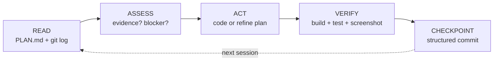
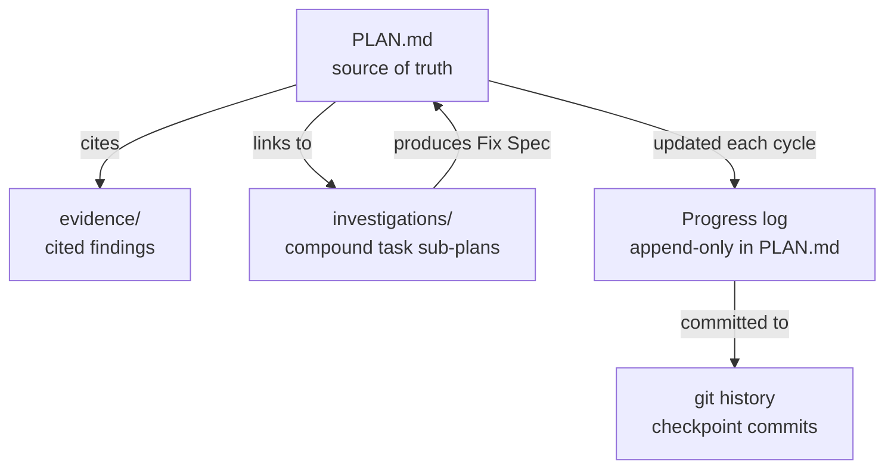

# Architecture

Vidux has three layers: **doctrine** (the rules), **the cycle** (the loop), and **the store** (the files).

```
┌─────���─────────────────────────────────────────┐
│                   DOCTRINE                    │
│  5 principles + gate patterns + stuck detect  │
└──────────────────────┬────────────────────────┘
                       │ governs
┌──────────────────────▼──────────────────────���─┐
│                   THE CYCLE                   │
│  Read → Assess → Act → Verify → Checkpoint   │
└──────────────────────┬─────────────────��──────┘
                       │ reads/writes
┌──────────────────────▼────────────────────────┐
│                   THE STORE                   │
│  PLAN.md + evidence/ + investigations/ + git  │
└─────────────────────────��─────────────────────┘
```

## File Layout

```
vidux/
├── SKILL.md              # Full contract: principles, cycle, PLAN.md template
├── DOCTRINE.md           # Extended doctrine (12 principles + gate patterns)
├── LOOP.md               # Stateless cycle mechanics
├── ENFORCEMENT.md        # Claude Code hook configuration
├── commands/             # Slash commands: /vidux (single entry — discipline + automation)
├── references/           # Deep docs loaded on demand (automation.md)
├── scripts/
│   ├── lib/              # Shared shell functions (compat.sh, etc.)
│   ├── vidux-loop.sh     # Cron driver — fires the cycle
│   ├── vidux-checkpoint.sh
│   ├── vidux-doctor.sh   # Diagnose plan/store health
│   └── vidux-fleet-*.sh  # Fleet management utilities
├── hooks/                # Git hooks for plan discipline
│   ├── hooks.json        # Claude Code hook definitions
│   ├── pre-commit-plan-check.sh
│   ├── post-commit-checkpoint.sh
│   └── three-strike-gate.sh
├── guides/               # Deep dives (not needed for basic use)
│   ├── draft-pr-flow.md  # How automation lanes push code
│   ├── fleet-ops.md      # Automation fleet management
│   ├── harness.md        # Writing automation prompts
│   ├── investigation.md  # Compound task L2 format
│   └── evidence-format.md
├── tests/                # Contract tests (pytest)
│   └── test_vidux_contracts.py
└── examples/             # Worked examples
    └── bug-fix-lifecycle/
```

## The Cycle

Every agent session — human-triggered or cron — runs the same five steps:



**Read:** Load PLAN.md, check for in-progress tasks (crash recovery), scan git log/diff.

**Assess:** Does the next task have evidence? If yes, execute. If no, gather it locally — no commit or PR until the fix ships.

**Act:** Execute one task or refine the plan. Agents keep working through the queue until they hit a real boundary — context limit, external blocker, or empty queue.

**Verify:** Build must pass. Tests must pass. UI work requires visual proof (screenshot, simulator). "It works" is never sufficient.

**Checkpoint:** Structured commit message. Update Progress log in PLAN.md. Record what happened, what's next, any blockers.

## The Store

State lives in markdown files in git. No databases. No daemons. No chat history.



A project has exactly **one PLAN.md**. Course corrections update the Decision Log — they never spawn a sibling plan. Evidence files back every plan entry. Investigation files handle compound tasks that need root cause analysis before code.

## Fleet Architecture

For automation at scale, vidux supports multiple agents working the same plan:

```
Writer Agent     ──┐
Radar Agent      ──┼── all read/write ──> PLAN.md (git branch)
Coordinator      ──┘
```

- **Writers** ship code. One writer per project surface.
- **Radars** monitor surfaces (read-only). They find work; they never fix it.
- **Coordinators** audit the fleet — flag stuck agents, handoff gaps, bimodal quality.

Each agent runs as a stateless cron. They share state through PLAN.md and git, never through memory or message passing.

## Hook Enforcement

Optional git hooks enforce plan discipline:

| Hook | What it checks |
|------|---------------|
| `pre-commit-plan-check.sh` | Code changes have a corresponding PLAN.md update |
| `post-commit-checkpoint.sh` | Checkpoint format is correct |
| `three-strike-gate.sh` | Same task stuck 3+ cycles = blocked |

Install with `bash scripts/install-hooks.sh /path/to/project`.

## Design Decisions

**Why markdown?** Any agent that reads files can participate. No SDK, no API, no vendor lock-in.

**Why one plan?** Multiple plan files create coordination overhead. One file, one truth. Decision Log handles pivots.

**Why stateless cycles?** Sessions die. Context windows fill. Auth expires. The only reliable thing is what's committed to git. Design for interruption, not for persistence.

**Why evidence-first?** A plan entry without evidence is a guess. Guesses cause rework. Evidence costs 2-5 minutes. Rework costs 15-60 minutes.
