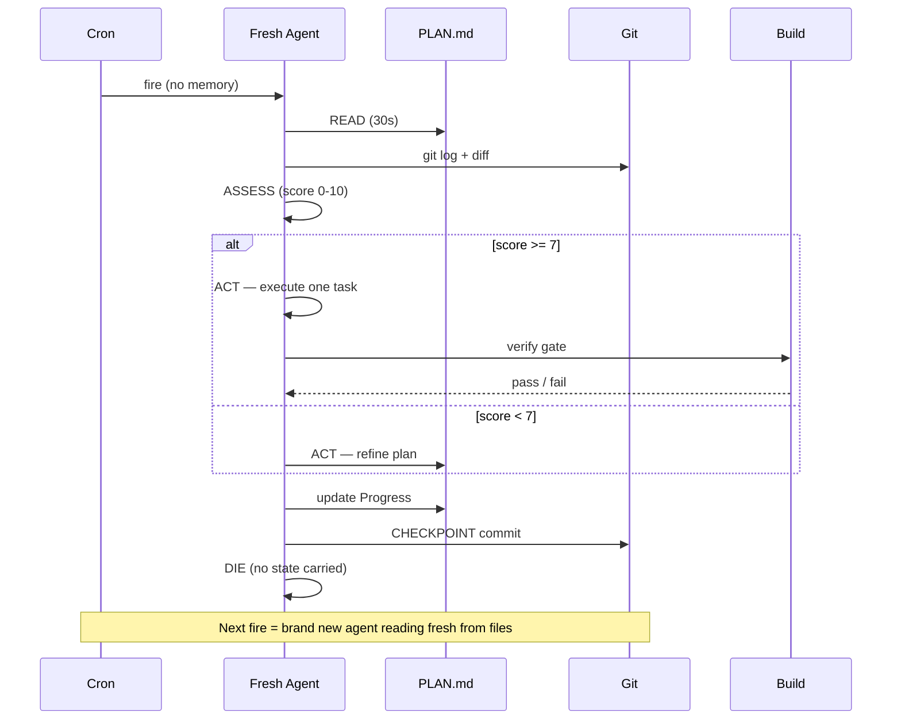

# Vidux Loop Mechanics

> The 30% — how the cron actually works.

## The Stateless Cycle

Every cron fire is a fresh context. No memory. No carried state. Just files.

```
[Cron fires] -> [Read PLAN.md] -> [Assess] -> [Act] -> [Checkpoint] -> [Die]
```



The agent that wakes up next time is a different agent. It knows nothing except what's in the files. Design for this. Always.

## Step 1: Read (30 seconds)

Read these files in order. Stop if any is missing — that's your first task.

1. `PLAN.md` — the source of truth. First look for any `[in_progress]` task (resume priority — a prior session may have died mid-task). If none found, find the first `[pending]` task (or unchecked `[ ]` in v1 plans).
2. **Decision Log** — read the `## Decision Log` section before doing anything else. If `vidux-loop.sh` output has `decision_log_warning: true`, review every entry. You MUST NOT contradict a logged direction. If your next action would, skip that action and move on.
3. `git log --oneline -10` — what happened recently? Any commits since last checkpoint?
4. `git diff --stat` — any uncommitted work from a crashed session?
5. Ledger (if available): `tail -5 ~/.agent-ledger/activity.jsonl | jq '.summary'`

If uncommitted work exists from a crash, commit it first with message `vidux: recover uncommitted work from crashed session`.

## Step 2: Assess (30 seconds)

Ask three questions:

### Q1: Is the plan ready for code?

Run this readiness checklist. Each item scores 1 point. Minimum 7/10 to start coding.

**Required (must all be true — 0 points if any fails):**
- [ ] Purpose section is filled (not empty, not placeholder)
- [ ] Evidence section has >= 3 cited sources with `[Source:]` markers
- [ ] Constraints section has at least one ALWAYS and one NEVER
- [ ] At least one Task exists with evidence cited
- [ ] Open Questions section has no items that are cited (as Q-refs) in the NEXT task's description

**Quality (each adds 1 point to the score):**
- [ ] Evidence includes at least one EXTERNAL source (MCP query, web search, not just codebase)
- [ ] Constraints include at least one stakeholder preference (reviewer, tech lead, PM)
- [ ] Tasks have dependency markers (`[Depends:]`) where applicable
- [ ] Decisions section has at least one entry with alternatives and rationale
- [ ] No task description is vague (no "implement feature" without specifics)

**Scoring:**
- **10/10:** Excellent plan. Execute with confidence.
- **7-9/10:** Good enough. Execute, but expect some surprises.
- **5-6/10:** Plan needs more evidence. Gather before coding.
- **0-4/10:** Plan is a sketch. Do NOT code. Spend the entire cycle on plan refinement.

**The 50/30/20 rule of thumb:** If your plan scores below 7, the cycle's "one deliverable"
should be improving the plan — not writing code. This is how the 50% plan refinement
budget gets enforced naturally.

If the plan is NOT ready, your job is to REFINE THE PLAN, not write code.

### Q2: What's the highest-impact next action?

Priority order:
1. **[in_progress] tasks** — resume; a prior session died mid-task
2. **Task-linked open questions** — research questions whose Q-ref (e.g. `Q1`, `Q3`) appears in the NEXT pending task's description (per-task gating, not global — a growing Q-list with no task citations does not block execution)
3. **[blocked] tasks whose blocker is now resolved** — set back to [pending]
4. **[pending] tasks without evidence** — gather evidence for them
5. **First [pending] task with evidence** — set to [in_progress] and execute it
6. **All tasks [completed]** — verify final state, update progress, mark mission complete

### Q3: Can I parallelize?

If two or more tasks are marked `[P]` (parallelizable) and have no dependencies:
- Spawn up to 3 background agents (one per task)
- Each agent gets: the task description, relevant PLAN.md sections, file scope
- Set `AGENT_LANE=<task-name>` and `AGENT_SKILLS=vidux` in each spawn
- Point guard (you) waits and synthesizes results

If tasks are serial: do one. Just one. Not two.

## Step 3: Act (bulk of the cycle)

### If RESUMING [in_progress] task:

A prior session died mid-task. Resume it:

1. **Read** the task description and any partial work in git diff
2. **Verify** if partial work is complete (build/test gate)
   - If complete: set to `[completed]` and checkpoint
   - If incomplete: continue execution from where it stopped
3. **Do not restart** from scratch — check what was already done first

### If REFINING THE PLAN:

**For evidence gathering (fan-out pattern):**
```
Spawn up to 4 research agents in parallel:
  Agent A: Search team chat for conventions and decisions
  Agent B: Search code reviews for related PRs and feedback
  Agent C: Read codebase for existing patterns (grep, glob)
  Agent D: Search issue tracker for requirements and constraints

Each returns a structured finding:
  { source: "...", finding: "...", confidence: high|medium|low }

You synthesize all findings into PLAN.md Evidence section.
```

**For answering open questions:**
- Pick the first open question cited in the next pending task (per-task gating)
- Research it (web search, MCP query, codebase read)
- Write the answer in the Evidence section
- Remove it from Open Questions (or convert to a constraint/decision)

**For adding tasks:**
- Based on evidence, decompose work into checkbox tasks
- Each task must cite its evidence source
- Mark parallelizable tasks with `[P]`
- Add dependency markers `[Depends: Task N]`

### If EXECUTING CODE (compound task with `[Investigation: ...]`):

The task links to an investigation file. Follow the compound task protocol:

1. **Read** the investigation file. Check: is the Fix Spec filled in?
   - If Fix Spec is empty: this cycle's job is to complete the investigation (evidence, root cause, impact map, fix spec). Checkpoint when done.
   - If Fix Spec is ready: proceed to execute below.
2. **Execute** the fix spec from the investigation file. One surface, all tickets.
3. **Verify** — run the gate from the investigation file.
4. **Update** both the investigation file (mark Gate items checked) and the parent task in PLAN.md (`[completed]`).

### If EXECUTING CODE (atomic task):

Follow the Vidux unidirectional flow:

1. **Locate** the task in PLAN.md. Read its description and evidence.
2. **Scope** the files. Never touch files not mentioned in the task.
3. **Execute** the code change. One task. Not two.
4. **Verify** — run the build/test gate specified in the task.
   - If pass: proceed to checkpoint.
   - If fail: retry once with targeted fix.
   - If still fails: run the failure protocol (SKILL.md § Failure Protocol).
5. **Update PLAN.md** — set the task to `[completed]`: `- [completed] Task N: ... [Done: date]`

### If ALL TASKS DONE:

1. Run final verification (full build + test suite)
2. Update Progress section: "All tasks complete. Final verification: [PASS/FAIL]"
3. If a PR exists, update its description
4. Mark mission as complete in ledger (if wired)

## Step 4: Checkpoint (30 seconds)

Every cycle MUST produce a checkpoint commit, even if no code changed.

**Commit message format:**
```
vidux: [what you did]

Plan: [which task was addressed]
Evidence: [new evidence gathered, if any]
Next: [what the next cycle should do]
Blocker: [if any, or "none"]
```

**Update PLAN.md Progress section:**
```
- [DATE TIME] Cycle N: [what happened]. Next: [what's next]. Blocker: [if any].
```

Push when ready — not required per-cycle. Git commit is the checkpoint, not git push.

**Checkpoint script (`vidux-checkpoint.sh`):** handles both v1 checkboxes and v2 FSM states.
Use `--status` to distinguish outcomes:
- `--status done` (default) — task verified; marks `[completed]`
- `--status done_with_concerns` — works but has caveats; marks `[completed]`, adds `[concerns noted]` to Progress
- `--status done_with_concerns --blocker "note"` — same as above, blocker field surfaced next READ
- `--status blocked` — external dependency; marks `[blocked]`, adds `[BLOCKED]` to Progress; loop skips to next task next cycle

Git failures propagate — a checkpoint script exit code > 0 means the commit did not land.

## Step 5: Die

The cycle is done. Exit cleanly. The next cron fire will read fresh from files.

Do NOT:
- Save state in memory
- Carry context to the "next step"
- Start a second task
- Leave uncommitted work

## Escalation Statuses

Borrowed from PAUL (Execute/Qualify loop). Every task ends in one of:

| Status | Meaning | Next Action |
|--------|---------|-------------|
| **DONE** | Task complete, verified | Set to `[completed]` in PLAN.md |
| **DONE_WITH_CONCERNS** | Works but has caveats | Set to `[completed]` + add concern to Surprises |
| **NEEDS_CONTEXT** | Can't proceed without more info | Keep as `[pending]`, add to Open Questions, skip to next task |
| **BLOCKED** | External dependency (human, CI, feature flag) | Set to `[blocked]` with `[Blocker: ...]` tag, skip |

**Script support (v2):** Pass `--status <done|done_with_concerns|blocked>` to `vidux-checkpoint.sh`. The script handles both v1 (`[ ]`/`[x]`) and v2 FSM states. `NEEDS_CONTEXT` is handled by the agent: keep the task `[pending]`, add to Open Questions, move on — no checkpoint flag needed.

## Per-Cycle Scorecard

Checkpoint existence is necessary but not sufficient proof of a productive cycle.
The scorecard makes cycle quality measurable so that `useful`, `busy`, and `blocked_clarified`
cycles are distinguishable from commit volume alone.

### Schema

```
outcome=<useful|busy|blocked_clarified>
  useful            — forward progress: code committed, evidence gathered, blocker resolved
  busy              — activity without delta: retries, investigation with no output
  blocked_clarified — blocker identified or scoped; reduces future cycles but no forward progress

blocker_age=<N>     — consecutive cycles the current blocker has been active (0 = no blocker)
retry=<N>           — times this task was attempted without reaching [completed]
evidence=<+N|-N|0>  — net change in cited evidence sources this cycle
proof=<descriptor>  — verifiable artifact change: "+1 deploy" | "+N tests" | "+1 commit" | "none"
control_plane=<green|yellow|red|n/a>
  green  — deploy healthy, error rate normal
  yellow — deploy delayed or warnings present
  red    — deploy failed or error rate elevated
  n/a    — no production control plane for this task
```

### Format in Progress entries

Append scorecard inline after the cycle summary, before "Next:":

```
- [2026-04-03] Cycle 7: Implemented auth boundary shell. outcome=useful blocker_age=0 retry=0 evidence=+2 proof=+1commit control_plane=green. Next: Task 5. Blocker: none.
```

All fields are optional — v1 Progress entries without scorecard remain valid.
When present, all fields appear on the same Progress line between summary and "Next:".

### Interpreting trends

| Pattern | Diagnosis | Action |
|---------|-----------|--------|
| `outcome=busy` x 2 | Task harder than planned | Break into sub-tasks |
| `outcome=busy` x 3 | Stuck loop | Run failure protocol (five-whys) |
| `blocker_age >= 3` | Blocker not resolving | Escalate to human |
| `evidence=0` x 3+ | Executing without evidence | Gather evidence before next cycle |
| `proof=none` x 4+ | Cycles not advancing proof | Re-assess plan readiness |
| `control_plane=red` | Production degraded | Stop feature work; fix infra first |

### How to populate

Scorecard is retrospective — filled at CHECKPOINT time, not at READ time.
When uncertain, prefer `outcome=busy` over `useful`. Calibration beats optimism.

## Stuck-Loop Detection

Borrowed from GSD. If the same task has been attempted in 3+ consecutive cycles without progress:

1. Check: is the task too large? Break it into sub-tasks.
2. Check: is evidence missing? Gather it first.
3. Check: is it actually blocked? Mark as BLOCKED and move on.
4. If none of the above: run the failure protocol (five-whys on agent behavior).

**Tooling support (v2):** `vidux-loop.sh` detects stuck loops via the `## Progress` section of PLAN.md — not git commit messages. If the task description (first 40 chars) appears in 3+ Progress entries and the task is still not `[completed]`, the loop sets `stuck: true` and `action: "stuck"`. This survives commit message variation and LLM compaction; the Progress section records the exact task text verbatim via checkpoint.

## UNIFY Step (Planned vs Actual)

Borrowed from PAUL. At the end of each cycle, reconcile:

- What the plan SAID would happen (the task description)
- What ACTUALLY happened (the git diff + test results)

If they diverge:
- Update the plan to reflect reality (not the other way around)
- Add a Surprise entry explaining the divergence
- Decide if downstream tasks need updating

## Example Cycle

```
Cycle 7 — Cron fires at 03:23

READ:
  PLAN.md: Task 4 is next ([pending], has evidence, no deps)
  git log: Last commit was "vidux: complete Task 3"
  git diff: Clean working tree

ASSESS:
  Plan is ready for code (all readiness checks pass)
  Highest impact: Task 4 (implement API client boundary shell)
  Not parallelizable (depends on Task 3)

ACT:
  Execute Task 4:
  - Read evidence: "boundary must expose 23 public methods (grep count)"
  - Write APIClientFeature.swift (229 lines)
  - Build: run project build — GREEN
  - Check off Task 4 in PLAN.md

CHECKPOINT:
  Commit: "vidux: Task 4 — boundary shell (APIClientFeature)"
  Plan: Task 4 complete. Next: Task 5 (entry-point wiring).

COMPLETE.
```

## Timing Budget

For a 20-minute cron interval, budget:

| Step | Time | Notes |
|------|------|-------|
| Read | 30s | File reads are fast |
| Assess | 30s | Decision is simple if plan is good |
| Act (plan refinement) | 15 min | Research agents + synthesis |
| Act (code execution) | 15 min | One task + build/test |
| Checkpoint | 1 min | Commit + push |
| Buffer | 3 min | For retries, errors |

If a task will take longer than 15 min, break it into sub-tasks that each fit in one cycle.
