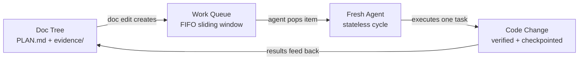

# Vidux

**The Redux of planned vibe coding.**

Vidux is a lightweight orchestration system for AI coding work that spans multiple sessions, agents, or days. It has exactly two data structures:

- **PLAN.md** — the store. The single source of truth. Every change flows through it.
- **A FIFO work queue** — the dispatch. Doc edits create work items; agents pop them and execute.

If you know Redux, you already know Vidux. The plan is the store. Code is the view. You never "just code" — you either update the plan (which creates work) or pop a work item (which was created by a plan update). That unidirectional flow is the whole trick.

<p align="center">
  
</p>



Every change moves through five steps: **Gather evidence -> Plan -> Execute -> Verify -> Checkpoint.** No step is skippable. If the code is wrong, the plan is wrong — fix the plan first. The store persists across sessions; each run dies. Any fresh agent can rehydrate from files and continue.

## Install

```bash
git clone git@github.com:leojkwan/vidux.git
ln -sfn /path/to/vidux ~/.claude/skills/vidux
ln -sfn /path/to/vidux ~/.cursor/skills/vidux
ln -sfn /path/to/vidux ~/.codex/skills/vidux
```

Then run `/vidux "your project description"` in Claude Code, Cursor, or Codex. The first cycle gathers evidence and writes a `PLAN.md`. No code is written until the plan is ready.

Optional enforcement hooks for a target repo:

```bash
bash scripts/install-hooks.sh /path/to/your/project
```

## Why It Exists

Most agent failures are state failures:

- the plan lived in chat instead of files
- code was written before evidence existed
- a later session could not tell what was intentional
- the same bug got "fixed" three different ways

Vidux solves that by making documentation the control plane. State lives in markdown files in a git branch — no databases, no daemons, no memory tricks. Any agent can read the files, understand the world, and pick up where the last one stopped.

## Core Invariants

A few hard rules that prevent the most common stateless-agent failures:

### One project, one `PLAN.md`

Every project has exactly ONE plan store. Course corrections — even dramatic pivots like "rewrite from scratch" or "throw away the old design" — update the existing plan's Decision Log, they do NOT spawn a sibling plan store. If an agent catches itself justifying a new plan with phrases like "clean slate", "emotional separation", or "this rewrite deserves its own home", that's fabricated reasoning and the rule says stop. New plans are for new PROJECTS (different codebase, different product, different problem surface), not new OPINIONS about the same project. The Decision Log is the memory of why a pivot happened — a new plan store throws that context away and forces future agents to re-derive the reasoning.

### Compound tasks + L2 investigations

Not every task is atomic. Messy surfaces get a compound task that links to an `investigations/<slug>.md` sub-plan. The L2 investigation has seven sections — Reporter Says / Evidence / Root Cause / Impact Map / Fix Spec / Tests / Gate — and **is the work** until the Fix Spec is filled. Parent L1 task only flips `[completed]` after the Fix Spec is coded, tested, and gated. Any cycle that tries to ship code while Fix Spec is still `(pending)` is a mechanism violation. Max nesting depth is 2 levels; L3 is rare and almost always means the surface should be split into separate L1 plans. See `SKILL.md` for a worked L1/L2 lifecycle example showing the state transitions.

### Observer pair (highest-ROI pattern)

Every writer lane should have a **read-only observer lane** that audits its files on an offset schedule. Writer fires at `:07`, observer fires at `:22` (15-minute gap) — audits land between writer cycles without racing. The observer reads `PLAN.md`, `PROGRESS.md`, per-lane `memory.md`, and logs, then writes a 5-section audit to `evidence/codex-audit-<timestamp>.md` with a one-word verdict: `SHIPPING` / `IDLE` / `WARNING` / `BLOCKED` / `CRASHED`.

Observers catch what the writer can't — wrong-flag bugs in its own invocation, non-chronological appends, stale cross-references, FSM violations, and strategic drift. Measured in a 38-audit experiment: observers caught 8 real issue clusters that writer self-audit missed, with 100% signal-to-noise. The observer lane never touches code or plan state; its only writes are its own audit files and its own `memory.md`. **Role-bleed is the main observer failure mode**, and the prompt's Authority block is what prevents it.

### Append-only `PROGRESS.md` and `memory.md`

Both are strictly append-only. Never rewrite old entries, not even during cleanup. Corrections go in NEW entries. Retroactive rewrites silently destroy the history that lets future agents understand how a decision was reached. Observer audits will flag out-of-order timestamps and missing entries as `WARNING`.

### 3x stuck rule

If the same task appears in 3+ consecutive `PROGRESS.md` entries while still `[in_progress]`, the lane exits with `[QC] 3x same outcome, nothing new. No deep work.` This is a **brake, not a kill** — the cron stays scheduled; only deep work stops burning budget until operator input arrives. When the blocker clears, the next cycle re-evaluates from a fresh gate and proceeds normally. This preserves auto-resume capability rather than forcing manual restart of the lane.

## What Ships Here

- `SKILL.md` — the full Vidux contract (architecture, doctrine, loop, PLAN.md template, compound task lifecycle, observer pair)
- `DOCTRINE.md` — the short doctrine (~5 minute read)
- `LOOP.md` — the stateless cycle mechanics
- `ENFORCEMENT.md` — Claude Code hook configuration
- `INGREDIENTS.md` — design lineage (10 patterns from 26 surveyed tools)
- `commands/` — `/vidux`, `/vidux-plan`, `/vidux-loop`, `/vidux-status`, `/vidux-dashboard`, `/vidux-recipes`, `/vidux-manager`, `/vidux-version`
- `scripts/` — loop driver, checkpoint, gather, doctor, witness, dispatch, prune, install
- `scripts/lib/` — compat.sh (macOS/Linux portability), codex-db.sh, ledger integration, queue-jsonl
- `hooks/` — prompt-hook nudges for plan discipline
- `guides/vidux/` — quickstart, architecture, best practices, radar template
- `tests/` — 160+ contract tests (scripts, commands, doctrine, SKILL.md structure)

### Companion skill: `/vidux-codex`

Vidux pairs naturally with `/vidux-codex`, a companion skill that adds **Claude-as-director / Codex-as-executor** delegation on top of the standard vidux cycle. Use it when Claude credits are the bottleneck and a task's read surface exceeds ~3 KB of source material. `/vidux-codex` offloads the read to Codex, returns a compressed 3-section summary (Summary / Evidence / Recommendation), and lets Claude apply taste to the verdict without spending its own budget grinding through files.

Measured savings under Framing B (Claude metered, Codex unlimited): **10x at 33 KB source, 49x at 160 KB, 110x at 357 KB** — linear with source size, no upper bound. The vidux cycle is unchanged; `/vidux-codex` adds exactly one optional delegation step between ASSESS and ACT. `/vidux-codex` ships separately (not in this repo) but is designed to compose with every pattern documented here.

## Fleet Intelligence (v2.3+)

Vidux includes self-healing mechanisms for automation fleets:

- **Circuit breaker** — `vidux-loop.sh` blocks deep work after N consecutive idle cycles (configurable, default 3). Prevents automations from burning cycles without shipping.
- **Idle-churn detection** — `vidux-witness.sh` reports per-automation `idle_churn_pct`. Automations where >50% of runs produce nothing get flagged.
- **Quick check gate** (quick check in scripts) — a copy-paste prompt block that forces agents to check for actionable work before loading skills or reading files. Exits in <60s when nothing to do.
- **Mid-zone kill** — deep-work enforcement: 3+ minutes with no file write = checkpoint and exit. Targets the 3-8 minute "stuck agent masquerading as polite" pattern.
- **Radar template** — shared harness template for read-only observer automations (`guides/vidux/radar-template.md`). ~800-1200 chars per radar prompt.
- **Cross-platform** — `scripts/lib/compat.sh` abstracts macOS/Linux differences (stat, date).

## Public Policy

This repo is public because the core ideas are meant to be reused and pressure-tested.

- Feedback is welcome through GitHub Issues.
- External pull requests are not being accepted yet.
- The public repo only ships the portable Layer 1 core, not private Layer 2 project wiring.

## Start Here

- [Quickstart](guides/vidux/quickstart.md)
- [Architecture](guides/vidux/architecture.md)
- [Best Practices](guides/vidux/best-practices.md)
