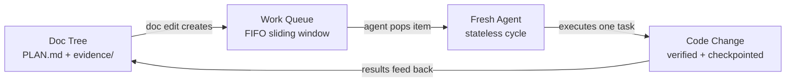

# Vidux

**The Redux of planned vibe coding.**

Vidux is a lightweight orchestration system for AI coding work that spans multiple sessions, agents, or days. It has exactly two data structures:

- **PLAN.md** — the store. The single source of truth. Every change flows through it.
- **A FIFO work queue** — the dispatch. Doc edits create work items; agents pop them and execute.

If you know Redux, you already know Vidux. The plan is the store. Code is the view. You never "just code" — you either update the plan (which creates work) or pop a work item (which was created by a plan update). That unidirectional flow is the whole trick.



Every change moves through five steps: **Gather evidence -> Plan -> Execute -> Verify -> Checkpoint.** No step is skippable. If the code is wrong, the plan is wrong — fix the plan first. The store persists across sessions; each dispatch dies. Any fresh agent can rehydrate from files and continue.

## Install

```bash
git clone git@github.com:leojkwan/vidux.git
ln -sfn /path/to/vidux ~/.claude/skills/vidux
ln -sfn /path/to/vidux ~/.cursor/skills/vidux
ln -sfn /path/to/vidux ~/.codex/skills/vidux
```

Then run `/vidux "your project description"` in Claude Code, Cursor, or Codex. The first cycle gathers evidence and writes a `PLAN.md`. No code is written until the plan is ready.

Optional enforcement hooks for a target repo:

```bash
bash scripts/install-hooks.sh /path/to/your/project
```

## Why It Exists

Most agent failures are state failures:

- the plan lived in chat instead of files
- code was written before evidence existed
- a later session could not tell what was intentional
- the same bug got "fixed" three different ways

Vidux solves that by making documentation the control plane. State lives in markdown files in a git branch — no databases, no daemons, no memory tricks. Any agent can read the files, understand the world, and pick up where the last one stopped.

## What Ships Here

- `SKILL.md` — the full Vidux contract (architecture, doctrine, loop, PLAN.md template)
- `DOCTRINE.md` — the short doctrine (~5 minute read)
- `LOOP.md` — the stateless cycle mechanics
- `ENFORCEMENT.md` — Claude Code hook configuration
- `INGREDIENTS.md` — design lineage (10 patterns from 26 surveyed tools)
- `commands/` — `/vidux`, `/vidux-plan`, `/vidux-status`, `/vidux-loop`
- `scripts/` — loop driver, checkpoint, gather, doctor, install helpers
- `hooks/` — prompt-hook nudges for plan discipline
- `guides/vidux/` — quickstart, architecture, best practices

## Public Policy

This repo is public because the core ideas are meant to be reused and pressure-tested.

- Feedback is welcome through GitHub Issues.
- External pull requests are not being accepted yet.
- The public repo only ships the portable Layer 1 core, not private Layer 2 project wiring.

## Start Here

- [Quickstart](guides/vidux/quickstart.md)
- [Architecture](guides/vidux/architecture.md)
- [Best Practices](guides/vidux/best-practices.md)
