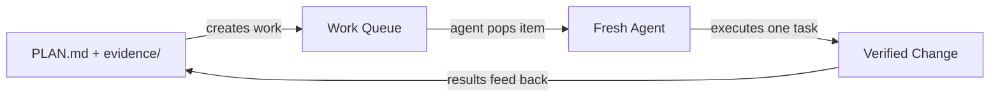

<p align="center">
  
</p>

<p align="center">
  <a href="https://github.com/leojkwan/vidux/stargazers"></a>
  <a href="LICENSE"></a>
  <a href="https://github.com/leojkwan/vidux/commits/main"></a>
</p>

# Vidux

**Plan first, code second.** Vidux is a lightweight orchestration system for AI coding work that spans multiple sessions, agents, or days.

- **One source of truth** — every project has a single `PLAN.md`. All decisions, pivots, and progress live there.
- **Stateless agents** — each run starts fresh, reads the plan, does one task, checkpoints, and exits. No memory tricks.
- **Works everywhere** — Claude Code, Cursor, Codex. Any agent that can read markdown can pick up where the last one stopped.

## Quick Start

```bash
git clone https://github.com/leojkwan/vidux.git
ln -sfn /path/to/vidux ~/.claude/skills/vidux
```

Then run `/vidux "your project description"` in Claude Code. The first cycle gathers evidence and writes a `PLAN.md`. No code is written until the plan is ready.

Optional enforcement hooks for a target repo:

```bash
bash scripts/install-hooks.sh /path/to/your/project
```

## How It Works

Every change moves through five steps. No step is skippable.

```
Gather evidence → Write plan → Execute one task → Verify → Checkpoint
```



If the code is wrong, the plan is wrong — fix the plan first. The store persists across sessions; each run dies. Any fresh agent can rehydrate from files and continue.

## Why It Exists

Most agent failures are state failures:

- the plan lived in chat instead of files
- code was written before evidence existed
- a later session could not tell what was intentional
- the same bug got "fixed" three different ways

Vidux solves that by making documentation the control plane. State lives in markdown files in a git branch — no databases, no daemons, no memory tricks. Any agent can read the files, understand the world, and pick up where the last one stopped.

## Core Invariants

A few hard rules that prevent the most common stateless-agent failures:

**One project, one `PLAN.md`** — course corrections update the existing plan's Decision Log, they never spawn a sibling plan. The Decision Log is the memory of why a pivot happened.

**Compound tasks + L2 investigations** — messy surfaces get a compound task that links to an `investigations/<slug>.md` sub-plan with seven sections. The L2 investigation is the work until the Fix Spec is filled.

**Observer pairs** — every writer lane should have a read-only observer lane that audits its files on an offset schedule. Observers catch what the writer can't — wrong flags, stale refs, strategic drift. 100% signal-to-noise measured across 38 audits.

**Append-only logs** — `PROGRESS.md` and `memory.md` are strictly append-only. Corrections go in new entries. Retroactive rewrites destroy the history future agents need.

**3x stuck rule** — if the same task appears in 3+ consecutive progress entries while still in-progress, the lane exits. This is a brake, not a kill — the cron stays scheduled until operator input arrives.

## What Ships Here

| Path | What |
|------|------|
| `SKILL.md` | Full contract: architecture, doctrine, loop, PLAN.md template, compound tasks, observer pairs |
| `DOCTRINE.md` | The short doctrine (~5 min read) |
| `LOOP.md` | Stateless cycle mechanics |
| `ENFORCEMENT.md` | Claude Code hook configuration |
| `INGREDIENTS.md` | Design lineage (10 patterns from 26 surveyed tools) |
| `commands/` | `/vidux`, `/vidux-plan`, `/vidux-fleet`, `/vidux-dashboard`, `/vidux-manager`, `/vidux-codex` |
| `scripts/` | Loop driver, checkpoint, gather, doctor, witness, dispatch, prune, install |
| `hooks/` | Prompt-hook nudges for plan discipline |
| `guides/` | Quickstart, architecture, best practices, radar template |
| `tests/` | 160+ contract tests |

## Companion: `/vidux-codex`

Vidux pairs with `/vidux-codex`, a companion skill that adds Claude-as-director / Codex-as-executor delegation. Use it when a task's read surface exceeds ~3 KB. Codex grinds through files and returns a compressed summary; Claude applies taste.

Measured savings (Claude metered, Codex unlimited): **10x at 33 KB, 49x at 160 KB, 110x at 357 KB** — linear with source size.

## Fleet Intelligence

Self-healing mechanisms for automation fleets:

- **Circuit breaker** — blocks deep work after N consecutive idle cycles
- **Idle-churn detection** — flags automations where >50% of runs produce nothing
- **Quick check gate** — exits in <60s when nothing to do
- **Mid-zone kill** — 3+ minutes with no file write = checkpoint and exit
- **Observer template** — shared harness for read-only audit automations
- **Cross-platform** — macOS/Linux portability via `scripts/lib/compat.sh`

## How Vidux Compares

| | Vidux | Raw Claude Code / Cursor | Aider / OpenCode |
|---|---|---|---|
| **State** | `PLAN.md` in git — survives sessions, agents, days | Chat history — dies when the window closes | Session-scoped context |
| **Multi-agent** | Any agent reads the same files and picks up | Single agent per session | Single agent |
| **Verification** | Built-in: evidence → plan → execute → verify → checkpoint | Trust the output | Trust the output |
| **Fleet ops** | Circuit breakers, observers, idle detection | N/A | N/A |
| **Agent agnostic** | Claude, Cursor, Codex — anything that reads markdown | Claude only | OpenAI / Anthropic |

Vidux doesn't replace your coding agent — it gives your agent a memory that outlasts the session.

## Examples

- [Bug Fix Lifecycle](examples/bug-fix-lifecycle/) — a complete walkthrough: evidence → plan → execute → verify → checkpoint

## Documentation

- [Draft PR Flow](guides/draft-pr-flow.md) — how automation lanes push code
- [Investigation Template](guides/investigation.md) — compound task L2 format
- [Fleet Ops](guides/fleet-ops.md) — automation fleet management
- [Harness Authoring](guides/harness.md) — writing automation prompts
- [Evidence Format](guides/evidence-format.md) — how to structure evidence files

## Sibling Project

**[claudux](https://github.com/leojkwan/claudux)** — documentation generator powered by Claude AI. If vidux is "plan before code," claudux is "docs before code." Same philosophy, different surface.

## Security

See [SECURITY.md](SECURITY.md) for reporting vulnerabilities.

## Contributing

This repo is public because the core ideas are meant to be reused and pressure-tested. Feedback is welcome through [GitHub Issues](https://github.com/leojkwan/vidux/issues). The public repo ships the portable Layer 1 core, not private Layer 2 project wiring.
