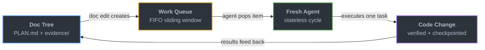
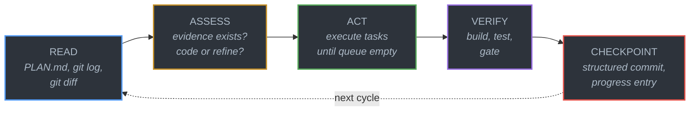

<p align="center">
  
</p>

<p align="center">
  <a href="https://github.com/leojkwan/vidux/stargazers"></a>
  <a href="LICENSE"></a>
  <a href="https://github.com/leojkwan/vidux/commits/main"></a>
</p>

# Vidux

**Plan first, code second.** Vidux is a lightweight orchestration system for AI coding work that spans multiple sessions, agents, or days.

- **One source of truth** — every project has a single `PLAN.md`. All decisions, pivots, and progress live there.
- **Stateless agents** — each run starts fresh, reads the plan, does one task, checkpoints, and exits. No memory tricks.
- **Works everywhere** — Claude Code, Cursor, Codex. Any agent that can read markdown can pick up where the last one stopped.

<p align="center">
  
</p>

## Quick Start

```bash
git clone https://github.com/leojkwan/vidux.git
ln -sfn /path/to/vidux ~/.claude/skills/vidux
```

Then run `/vidux "your project description"` in Claude Code. The first cycle gathers evidence and writes a `PLAN.md`. No code is written until the plan is ready.

Optional enforcement hooks for a target repo (copy from `hooks/`):

```bash
cp hooks/pre-commit-plan-check.sh /path/to/your/project/.git/hooks/pre-commit
cp hooks/post-commit-checkpoint.sh /path/to/your/project/.git/hooks/post-commit
cp hooks/three-strike-gate.sh /path/to/your/project/.git/hooks/
```

## How It Works

Every change flows through a four-stage loop. Documentation is the control plane — not chat, not memory.



Inside each agent run, five steps execute in order. No step is skippable:



If the code is wrong, the plan is wrong — fix the plan first. The store persists across sessions; each run dies. Any fresh agent can rehydrate from files and continue.

## Why It Exists

Most agent failures are state failures:

- the plan lived in chat instead of files
- code was written before evidence existed
- a later session could not tell what was intentional
- the same bug got "fixed" three different ways

Vidux solves that by making documentation the control plane. State lives in markdown files in a git branch — no databases, no daemons, no memory tricks. Any agent can read the files, understand the world, and pick up where the last one stopped.

## How Vidux Compares

| | Vidux | Raw Claude Code / Cursor | Aider / OpenCode |
|---|---|---|---|
| **State** | `PLAN.md` in git — survives sessions, agents, days | Chat history — dies when the window closes | Session-scoped context |
| **Multi-agent** | Any agent reads the same files and picks up | Single agent per session | Single agent |
| **Verification** | Evidence → plan → execute → verify → checkpoint | Trust the output | Trust the output |
| **Fleet ops** | Ready-PR flow, session-gc, idle detection | N/A | N/A |
| **Agent agnostic** | Claude, Cursor, Codex — anything that reads markdown | Tool-specific | OpenAI / Anthropic |

Vidux doesn't replace your coding agent — it gives your agent a memory that outlasts the session.

## Core Invariants

A few hard rules that prevent the most common stateless-agent failures:

**One project, one `PLAN.md`** — course corrections update the existing plan's Decision Log, they never spawn a sibling plan. The Decision Log is the memory of why a pivot happened.

**Compound tasks link to an investigation file** — messy surfaces get a compound task pointing at `investigations/<slug>.md` with seven sections (Reporter Says / Evidence / Root Cause / Impact Map / Fix Spec / Tests / Gate). The investigation IS the work until the Fix Spec is filled; then the fix and the investigation ship together as one commit. One parent plan, one child investigation per compound task — no deeper nesting.

**Append-only logs** — the `## Progress` section in `PLAN.md` and each lane's `memory.md` are append-only. Corrections go in new entries, not rewrites. Some overlays also keep a separate `PROGRESS.md`, but core vidux does not require it.

**3x stuck rule** — same task in 3+ consecutive progress entries while in-progress = auto-exit. Brake, not kill.

## Status & Config

```bash
python3 scripts/vidux-status.py
```

Scans every `PLAN.md` under `~/Development/`, renders a two-bucket board: plans tied to the current repo vs everything else tracked on the machine. Each row: 10-cell progress bar, remaining AI-hours (sum of `[ETA: Xh]` tags on active tasks), last activity timestamp. Flags: `--all` (include empty / shipped / stale), `--json`, `--focus <repo...>`, `--root <path>`.

Config lives at `vidux.config.json` in the repo root. The only required key is `plan_store`:

```json
{
  "plan_store": {
    "mode": "local",
    "path": "~/Development/vidux/projects"
  }
}
```

- `mode: "inline"` — plans live in the current repo as `PLAN.md` (default when no config is present)
- `mode: "local"` — plans live at a configured path, one subdir per project
- `mode: "external"` — same as local but path may point outside `~/Development`

Agents read this at session start and resolve the authority `PLAN.md` before doing anything else.

## What Ships Here

| Path | What |
|------|------|
| `SKILL.md` | Part 1 only — discipline, cycle, PLAN.md template, compound tasks (~280 lines) |
| `guides/automation.md` | Part 2 (opt-in) — 24/7 fleet model, session-gc, lane bootstrap, delegation |
| `guides/recipes/` | 12 opt-in recipes — CLAUDE.md rules, lane prompts, subagent delegation, Codex runtime, friction patterns |
| `CHANGELOG.md` | Release notes — latest doctrine changes and migration notes |
| `DOCTRINE.md` | The short doctrine (~5 min read) |
| `LOOP.md` | Stateless cycle mechanics |
| `ENFORCEMENT.md` | Claude Code hook configuration |
| `INGREDIENTS.md` | Design lineage (10 patterns from 26 surveyed tools) |
| `commands/` | `/vidux` (single entry point — Part 1 inline, Part 2 + recipes on demand) |
| `references/` | `automation.md` — deep doctrine (session-gc internals, Codex shim gotchas, PR lifecycle) |
| `scripts/` | vidux-loop, vidux-checkpoint, vidux-doctor, vidux-worktree-gc, vidux-fleet-quality, vidux-fleet-rebuild, vidux-test-all |
| `scripts/lib/` | compat.sh, codex-db.sh, ledger-config.sh, ledger-emit.sh, ledger-query.sh, queue-jsonl.sh, resolve-plan-store.sh |
| `hooks/` | Prompt-hook nudges for plan discipline |
| `guides/` | automation, draft-pr-flow, evidence-format, fleet-ops, harness, investigation, recipes/ |
| `tests/` | Contract and lifecycle tests (scripts, commands, doctrine, worktree lifecycle, SKILL.md structure) |
| `examples/` | Worked examples (bug fix lifecycle, fleet reference) |

## Ecosystem

Vidux has **one entry point** — `/vidux` — loading the core discipline inline. The automation layer and the recipes layer are opt-in: load `guides/automation.md` and `guides/recipes/*.md` only when the task calls for them. Vidux runs single-tool: you run on Claude with Claude subagents, or on Codex with Codex subagents. Never both at once.

| Skill | What it does | Ships in this repo? |
|---|---|---|
| `/vidux` | Plan-first cycle (Part 1 inline) — read, assess, act, verify, checkpoint. Part 2 automation + recipes loaded on demand | Yes |
| `/pilot` | Universal project lead — detects stack and stage, routes into `/vidux` when needed | No (separate) |
| `/ledger` | Append-only JSONL activity log for multi-agent coordination across tools | No (separate) |

For deep automation details (session-gc internals, Codex shim registration, PR lifecycle nursing, cross-fleet coordination), `/vidux` reads [`guides/automation.md`](guides/automation.md) and [`references/automation.md`](references/automation.md) on demand — neither is loaded upfront.

## Platform Automation

Vidux is platform-agnostic — the cycle works for humans, one-shot sessions, and cron-scheduled fleets. As of 2.10.0, the automation layer lives in [`guides/automation.md`](guides/automation.md) (opt-in Part 2 content), with the deep doctrine in [`references/automation.md`](references/automation.md):

- **Session management** — CronCreate lanes, session-gc, JSONL growth control
- **Lane operations** — coordinator pattern, decision tree, 6-lane hard cap
- **Subagent dispatch** — spawning fresh-context subagents for heavy reads or isolated implementation work
- **Lane bootstrap recipe** — role picker (coordinator / burst / radar), file templates, registration steps
- **Fleet ops** — discover, prescribe, validate, audit across automation fleets
- **PR lifecycle** — PR Nurse pattern, triage at cycle start, self-review before push

See [guides/fleet-ops.md](guides/fleet-ops.md) and [guides/recipes.md](guides/recipes.md) for full lifecycle docs and setup guides.

## Fleet Patterns

Patterns for autonomous multi-lane fleets. See [`guides/automation.md`](guides/automation.md) and [`references/automation.md`](references/automation.md) for mechanics, plus the [recipe catalog](guides/recipes/) for ready-to-deploy patterns with prompt templates.

- **Ready-PR-first** — automation pushes open ready-for-review by default so review bots run; draft is reserved for true WIP or missing gates ([guide](guides/draft-pr-flow.md))
- **Progress is code change** — PRs that only touch `PLAN.md` / `investigations/` / `evidence/` / `INBOX.md` are bookkeeping, not progress. Bundle plan updates into the code PR, or keep notes local ([CHANGELOG](CHANGELOG.md#290--2026-04-17))
- **`observed` evidence type** — user-observed app behavior is first-class plan evidence alongside grep hits and PR comments
- **3x stuck rule** — same task in 3+ consecutive progress entries = auto-exit

## Lessons from Production (Apr 2026 fleet run)

Three findings from running 35+ Claude lanes and Codex agents across 5 repos for 48 hours:

**1. Stuck crons need exit conditions.** A verification cron confirmed PR #9 was live, then re-verified it 300+ times over 2 hours. Fix: after success, mark done and stop. The 3x stuck rule catches *failing* loops; *succeeding* loops that don't exit are a different bug.

**2. Ledger noise drowns signal.** The vidux-loop cron produced 395K empty `vidux_loop_start` entries in 2 days — 99.7% of all ledger volume. Fix: log once when idle, not per-PID per-fire. The ledger is only useful if real events are findable.

**3. Subagent dispatch keeps the parent context lean.** Heavy reads (30+ file audits) and isolated implementation slices delegate to fresh-context subagents via `Agent()`. The parent session reads only the summary or diff, not the raw source — this is the main lever for running productive 24/7 fleets without hitting compaction pressure. See [`guides/recipes/subagent-delegation.md`](guides/recipes/subagent-delegation.md).

## Documentation

- [Architecture](ARCHITECTURE.md) — three-layer overview with diagrams
- [Harness Setup](guides/harness.md) — writing automation prompts
- [Evidence Format](guides/evidence-format.md) — how to structure evidence files
- [Fleet Operations](guides/fleet-ops.md) — automation fleet management
- [Investigation Lifecycle](guides/investigation.md) — the parent-plan + child-investigation pattern
- [Ready PR Flow](guides/draft-pr-flow.md) — how automation lanes push code
- [Automation Recipes](guides/recipes.md) — 8 ready-to-deploy fleet patterns with prompt templates
- [Examples](examples/) — worked examples (start with [bug fix lifecycle](examples/bug-fix-lifecycle/))

## Sibling Project

**[claudux](https://github.com/leojkwan/claudux)** — documentation generator with multi-backend AI support (Claude + Codex). If vidux is "plan before code," claudux is "docs before code." Same philosophy, different surface: claudux can target multiple generation backends, while vidux runs inside whichever runtime you launch.

## Contributing

This repo is public because the core ideas are meant to be reused and pressure-tested. Feedback is welcome through [GitHub Issues](https://github.com/leojkwan/vidux/issues). The public repo ships the portable Layer 1 core, not private Layer 2 project wiring.

See [CONTRIBUTING.md](CONTRIBUTING.md) for contribution guidelines and [SECURITY.md](SECURITY.md) for the vulnerability reporting policy.
