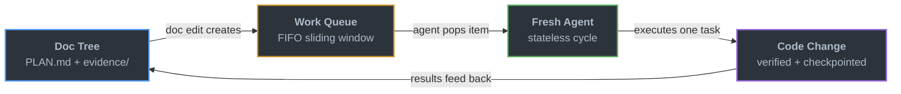
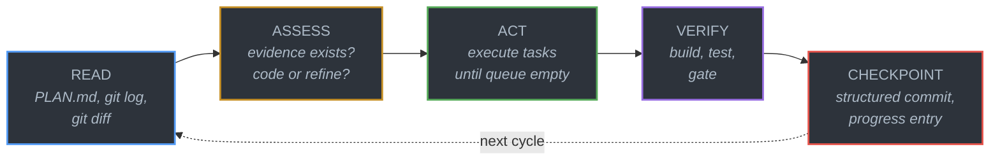
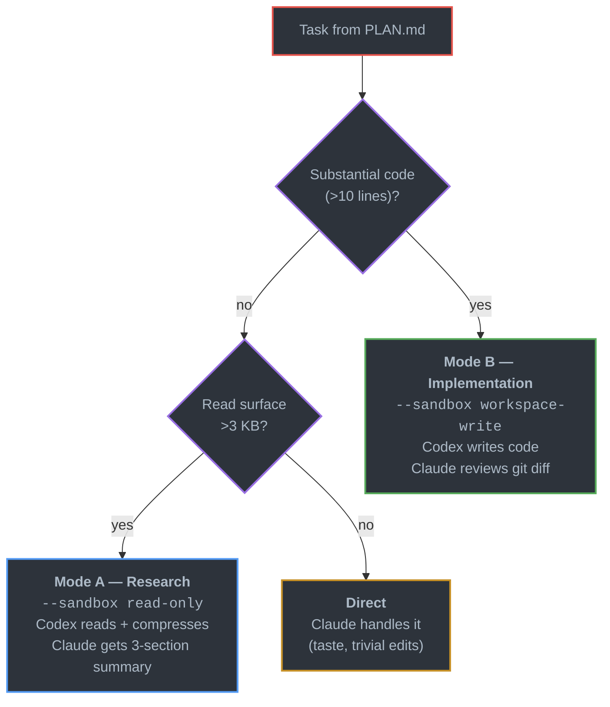

<p align="center">
  
</p>

<p align="center">
  <a href="https://github.com/leojkwan/vidux/stargazers"></a>
  <a href="LICENSE"></a>
  <a href="https://github.com/leojkwan/vidux/commits/main"></a>
</p>

# Vidux

**Plan first, code second.** Vidux is a lightweight orchestration system for AI coding work that spans multiple sessions, agents, or days.

- **One source of truth** — every project has a single `PLAN.md`. All decisions, pivots, and progress live there.
- **Stateless agents** — each run starts fresh, reads the plan, does one task, checkpoints, and exits. No memory tricks.
- **Works everywhere** — Claude Code, Cursor, Codex. Any agent that can read markdown can pick up where the last one stopped.

<p align="center">
  
</p>

## Quick Start

```bash
git clone https://github.com/leojkwan/vidux.git
ln -sfn /path/to/vidux ~/.claude/skills/vidux
```

Then run `/vidux "your project description"` in Claude Code. The first cycle gathers evidence and writes a `PLAN.md`. No code is written until the plan is ready.

Optional enforcement hooks for a target repo (copy from `hooks/`):

```bash
cp hooks/pre-commit-plan-check.sh /path/to/your/project/.git/hooks/pre-commit
cp hooks/post-commit-checkpoint.sh /path/to/your/project/.git/hooks/post-commit
cp hooks/three-strike-gate.sh /path/to/your/project/.git/hooks/
```

## How It Works

Every change moves through five steps. No step is skippable.



Every cycle follows five steps — the unidirectional loop that prevents state drift:



If the code is wrong, the plan is wrong — fix the plan first. The store persists across sessions; each run dies. Any fresh agent can rehydrate from files and continue.

## Why It Exists

Most agent failures are state failures:

- the plan lived in chat instead of files
- code was written before evidence existed
- a later session could not tell what was intentional
- the same bug got "fixed" three different ways

Vidux solves that by making documentation the control plane. State lives in markdown files in a git branch — no databases, no daemons, no memory tricks. Any agent can read the files, understand the world, and pick up where the last one stopped.

## How Vidux Compares

| | Vidux | Raw Claude Code / Cursor | Aider / OpenCode |
|---|---|---|---|
| **State** | `PLAN.md` in git — survives sessions, agents, days | Chat history — dies when the window closes | Session-scoped context |
| **Multi-agent** | Any agent reads the same files and picks up | Single agent per session | Single agent |
| **Verification** | Evidence → plan → execute → verify → checkpoint | Trust the output | Trust the output |
| **Fleet ops** | Observer pairs, draft-PR flow, idle detection | N/A | N/A |
| **Agent agnostic** | Claude, Cursor, Codex — anything that reads markdown | Tool-specific | OpenAI / Anthropic |

Vidux doesn't replace your coding agent — it gives your agent a memory that outlasts the session.

## Core Invariants

A few hard rules that prevent the most common stateless-agent failures:

**One project, one `PLAN.md`** — course corrections update the existing plan's Decision Log, they never spawn a sibling plan. The Decision Log is the memory of why a pivot happened.

**Compound tasks + L2 investigations** — messy surfaces get a compound task that links to an `investigations/<slug>.md` sub-plan with seven sections. The L2 investigation is the work until the Fix Spec is filled.

**Observer pairs** — every writer lane should have a read-only observer lane that audits its files on an offset schedule. Observers catch what the writer can't — wrong flags, stale refs, strategic drift. 100% signal-to-noise measured across 38 audits.

**Append-only logs** — `PROGRESS.md` and `memory.md` are strictly append-only. Corrections go in new entries. Retroactive rewrites destroy the history future agents need.

**3x stuck rule** — if the same task appears in 3+ consecutive progress entries while still in-progress, the lane exits. This is a brake, not a kill — the cron stays scheduled until operator input arrives.

## What Ships Here

| Path | What |
|------|------|
| `SKILL.md` | Full contract: architecture, doctrine, loop, PLAN.md template, compound tasks, observer pairs |
| `DOCTRINE.md` | The short doctrine (~5 min read) |
| `LOOP.md` | Stateless cycle mechanics |
| `ENFORCEMENT.md` | Claude Code hook configuration |
| `INGREDIENTS.md` | Design lineage (10 patterns from 26 surveyed tools) |
| `commands/` | `/vidux`, `/vidux-plan`, `/vidux-fleet`, `/vidux-claude`, `/vidux-dashboard`, `/vidux-manager` |
| `scripts/` | vidux-loop, vidux-checkpoint, vidux-doctor, vidux-fleet-quality, vidux-fleet-rebuild, vidux-test-all |
| `scripts/lib/` | compat.sh, codex-db.sh, ledger-config.sh, ledger-emit.sh, ledger-query.sh, queue-jsonl.sh, resolve-plan-store.sh |
| `hooks/` | Prompt-hook nudges for plan discipline |
| `guides/` | draft-pr-flow, evidence-format, fleet-ops, harness, investigation, recipes (includes Routines primer L11-70 and Hybrid Strategy L491-502) |
| `tests/` | 144 contract tests (scripts, commands, doctrine, SKILL.md structure) |
| `examples/` | Worked examples (bug fix lifecycle) |

## Ecosystem

Vidux is the core discipline. These companion skills extend it for specific workflows:

| Skill | What it does | Ships in this repo? |
|---|---|---|
| `/vidux` | The full plan-first cycle — read, assess, act, verify, checkpoint | Yes |
| `/vidux-plan` | Plan-only mode — creates or refines a PLAN.md without writing code | Yes |
| `/vidux-fleet` | Create, manage, and audit automation fleets — schedules, roles, health checks | Yes |
| `/vidux-manager` | Self-diagnostic agent — runs plan quality tests, validates fleet health | Yes |
| `/vidux-dashboard` | Cross-project visibility — shows all plans as a tree with status and health | Yes |
| `/vidux-claude` | Automation lane management — CronCreate crons AND Claude Routines (cloud-native, persistent). Create, diagnose, migrate lanes. | Yes |
| `/vidux-codex` | Two delegation modes: **research** (read-only, compressed summary) and **implementation** (workspace-write, Codex writes code, Claude reviews diff) | No (separate) |
| `/pilot` | Universal project lead — detects stack and stage, routes into vidux when needed | No (separate) |
| `/ledger` | Append-only JSONL activity log for multi-agent coordination across tools | No (separate) |

The in-repo skills (`commands/`) work standalone. The external skills are optional and compose with the core cycle without changing it.

## Companion: `/vidux-codex`

Vidux pairs with `/vidux-codex` for two delegation modes:



| Role | Claude (metered) | Codex (unlimited) |
|---|---|---|
| Read plans | Small reads only | Delegate if > 3 KB |
| Decide approach | Yes (taste) | Never |
| Write code | Only < 10 lines | All substantial code |
| Review diffs | Yes | Never |
| Build/test | Yes (local toolchain) | Can't (no Xcode/env) |
| Commit/push | Yes | Never |

**Research savings** (Mode A): 10x at 33 KB, 49x at 160 KB, 110x at 357 KB — linear with source size.
**Implementation savings** (Mode B): ~3-5x further per cycle — Claude drops from ~10K tokens (writing code) to ~2-3K (reviewing a diff).

## Fleet Intelligence

Patterns for autonomous multi-lane fleets, now powered by **Claude Routines** (cloud-native, persistent, three trigger types — scheduled, GitHub event, API). New lanes go through `/schedule`; CronCreate still works for session-scoped experiments; Codex `automation.toml` is legacy. See the [Routines primer](guides/recipes.md#how-routines-work) and [Hybrid Strategy: Routines + CronCreate](guides/recipes.md#hybrid-strategy-routines--croncreate) for when-to-use-which.

- **Draft-PR-first** — all automation pushes go through `gh pr create --draft`, never direct-to-main. Human promotes. ([guide](guides/draft-pr-flow.md))
- **PR review pipeline** — Greptile AI review + architecture agent on every draft PR. Automated quality gate before human review. ([recipe](guides/recipes.md#recipe-2-pr-reviewer))
- **Observer pairs** — every writer lane has a read-only observer that catches wrong flags, stale refs, and strategic drift. 100% signal measured across 38 audits. ([recipe](guides/recipes.md#recipe-4-observer-pair))
- **Fleet watcher** — scheduled health check across all lanes. Scorecard: SHIPPING / IDLE / BLOCKED / CRASHED. Escalates stuck lanes automatically. ([recipe](guides/recipes.md#recipe-1-fleet-watcher))
- **3x stuck rule** — same task in 3+ consecutive progress entries = auto-exit. Brake, not kill.
- **Idle detection** — 2+ consecutive IDLE checkpoints = lane self-terminates rather than burning cycles on nothing.
- **Deploy watcher** — verifies deployment after merge, with hard exit condition (never re-verify 300+ times). ([recipe](guides/recipes.md#recipe-5-deploy-watcher))
- **Delegation modes** — research (read-only) vs implementation (workspace-write) per `/vidux-codex`. Lanes choose the mode per-task.
- **8 ready-to-deploy recipes** — fleet watcher, PR reviewer, lifecycle manager, observer pair, deploy watcher, trunk health, skill refiner, self-improvement loop. ([full catalog](guides/recipes.md))

## Lessons from Production (Apr 2026 fleet run)

Three findings from running 35+ Claude lanes and Codex agents across 5 repos for 48 hours:

**1. Stuck crons need exit conditions.** A verification cron confirmed PR #9 was live, then re-verified it 300+ times over 2 hours. Fix: after success, mark done and stop. The 3x stuck rule catches *failing* loops; *succeeding* loops that don't exit are a different bug.

**2. Ledger noise drowns signal.** The vidux-loop cron produced 395K empty `vidux_loop_start` entries in 2 days — 99.7% of all ledger volume. Fix: log once when idle, not per-PID per-fire. The ledger is only useful if real events are findable.

**3. Workspace-write flips the cost model.** When Codex writes code (`--sandbox workspace-write`) and Claude only reviews the diff, per-cycle Claude cost drops from ~10K tokens to ~2-3K. The expensive part (code generation) shifts to the unlimited Codex budget. This is now Mode B in `/vidux-codex`.

## Documentation

- [Architecture](ARCHITECTURE.md) — three-layer overview with diagrams
- [Harness Setup](guides/harness.md) — writing automation prompts
- [Evidence Format](guides/evidence-format.md) — how to structure evidence files
- [Fleet Operations](guides/fleet-ops.md) — automation fleet management
- [Investigation Lifecycle](guides/investigation.md) — compound task L2 format
- [Draft PR Flow](guides/draft-pr-flow.md) — how automation lanes push code
- [Automation Recipes](guides/recipes.md) — 8 ready-to-deploy fleet patterns with prompt templates
- [Examples](examples/) — worked examples (start with [bug fix lifecycle](examples/bug-fix-lifecycle/))

## Sibling Project

**[claudux](https://github.com/leojkwan/claudux)** — documentation generator with multi-backend AI support (Claude + Codex). If vidux is "plan before code," claudux is "docs before code." Same philosophy, different surface. Both skills let you pick between Claude (metered, taste) and Codex (unlimited, grunt work) for the heavy lifting.

## Contributing

This repo is public because the core ideas are meant to be reused and pressure-tested. Feedback is welcome through [GitHub Issues](https://github.com/leojkwan/vidux/issues). The public repo ships the portable Layer 1 core, not private Layer 2 project wiring.

See [SECURITY.md](SECURITY.md) for the vulnerability reporting policy.
