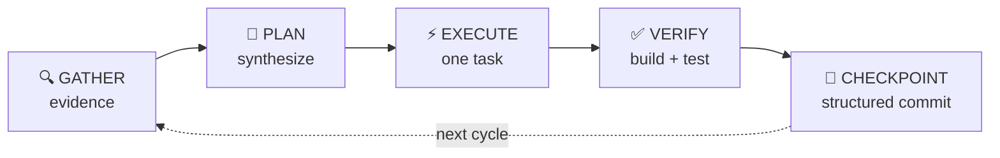

# Vidux

> **The Redux of planned vibe coding.**
> The plan is the store. Code is the view. Work flows from plan changes.

## Architecture: Two Data Structures

Vidux has exactly two data structures. Everything else is derived.

### 1. Documentation Tree (the store)

A markdown-based tree of folders and docs. Flat or nested — whatever the project needs.
This is the single source of truth. All knowledge, plans, evidence, and decisions live here.

```
vidux/
  PLAN.md              — purpose, tasks, constraints, decisions
  evidence/            — cached MCP queries, codebase analysis, stakeholder research
  constraints/         — reviewer preferences, team conventions, architecture rules
  decisions/           — what was decided, alternatives, rationale
```

Changes to the documentation tree are the PRIMARY work product.
Code changes are SECONDARY — they are derived from doc changes.

## Relationship To Pilot

- Vidux is not a second universal router. Pilot is the entrypoint; Vidux is the expedition-scale plan/store loop.
- When both `pilot` and `vidux` are present, Pilot does stack detection, stage detection, and read-the-room once, then Vidux owns the plan, queue, and checkpoint cycle.
- Quick hits, small bug fixes, and generic repo maintenance stay in Pilot unless the user explicitly asks for Vidux or an existing Vidux plan already governs the work.
- Do not run a second Pilot-owned orchestration loop on top of an active Vidux plan. One store, one queue, one checkpoint chain.

### 2. Work Queue (FIFO, sliding window)

A queue of work items produced by documentation changes.
When a doc changes, it creates a work slice in the queue.

```
QUEUE.md (or embedded in PLAN.md Tasks section):
  Hot window: last 30 items (always in context, always queryable)
  Cold storage: item 31+ (in git history, retrievable but not loaded)
```

Agents pop items from the queue, execute them, and checkpoint.
Execution results feed back into the documentation tree (new evidence, surprises, progress).

### The Unidirectional Flow

```
[Agents update docs] -> [Doc changes create queue items] -> [Agents pop and execute]
        ^                                                            |
        |______________ results feed back into docs _________________|
```

Agents NEVER "just code." They either:
1. **Update docs** (which creates queue items), or
2. **Pop queue items** (which were created by doc updates)

This is Redux. Docs = store. Doc edits = actions. Queue = dispatch. Code = view.

---

## Working Philosophy

Vidux agents do not wait. Every agent — writer, scanner, coordinator — is proactive by default. Proactiveness is not a special trait bolted onto certain roles. It is the baseline posture. An agent that parks when there is no assigned task has failed before it started.

**When there is no task, find one.** Scan the plan. Read the evidence. Check what changed since last cycle. Something always needs doing — a stale assumption, a gap in evidence, a task that should exist but does not. The whole point of vidux is anticipating what needs to happen next, not waiting to be told.

**When the human returns, brief them.** Do not make them dig. Present a clear picture:

- Here is what happened while you were away.
- Here are the 20 things we could do next.
- I picked this one, and here is why.
- Steer me.

That last line is the most important. A vidux agent is not a fire-and-forget missile. It takes a direction and makes the alternatives crystal clear, so the human can redirect with minimal effort.

**Be hungry for steering.** Do not treat silence as confirmation. Silence means the human has not seen your work yet, or has not had time to respond. When you surface a decision point, flag it. When you pick a direction, say what you did not pick. When a cycle passes with no human input, raise the question again — do not assume "keep going exactly as before" is the answer.

The spirit is simple: act first, show your work, make it easy to course-correct.

---

## Doctrine (the 60%)

These principles account for 60% of Vidux's effectiveness. They are non-negotiable.

### 1. Plan is the store

PLAN.md is the single source of truth. Code is a derived view.
If the code is wrong, the plan is wrong. Fix the plan, then fix the code.

### 2. Unidirectional flow

```
GATHER evidence (MCP, team chat, code reviews, issue tracker, knowledge base, codebase)
  -> PLAN (synthesize evidence into structured spec)
    -> EXECUTE (code one task from the plan)
      -> VERIFY (build, test, gate)
        -> CHECKPOINT (structured handoff, ledger event)
          -> loop back to GATHER
```



You NEVER skip steps. You never code without a plan entry. To change code in a way
the plan doesn't specify, you MUST update the plan first.

### 3. The 50/30/20 split

- **50% plan refinement** — gathering evidence, synthesizing, pruning, updating PLAN.md
- **30% code** — derived from plan entries, one task at a time
- **20% last mile** — build errors, feature flags, CI gates, reviewer feedback, things outside the closed loop

If you find yourself coding more than planning, you are doing it wrong.

### 4. Evidence over instinct

Every plan entry MUST cite at least one evidence source:
- MCP query result (team chat message, PR comment, issue tracker ticket, knowledge base search)
- Codebase grep (file path + line number + pattern found)
- Design doc quote (with link or file path)
- Team convention (cited from a skill, CLAUDE.md, or explicit reviewer preference)

A plan entry without evidence is a guess. Guesses cause rework.

### 5. Design for completion

Every deep work run will end. Context will be lost. Auth will expire. **Compaction will fire.**
The store persists. The run doesn't. Therefore:
- State lives in files (PLAN.md, git branch), not in memory
- Every cycle reads fresh from files, never carries context forward
- Checkpoints are structured (not freeform summaries)
- Any agent can resume from the last checkpoint
- Tool state (.claude/, .cursor/) lives outside the repo — never in the working tree

**Compaction survival (all tools):**
- Compaction is **lossy**. Checkpoint to repo files BEFORE it fires.
- After compaction or any interruption, re-read PLAN.md and evidence/ from disk. Never trust compaction summaries for plan details.
- For long sessions, prefer spawning subagents (each gets a fresh context window).
- One owned mission/lane per session. PLAN.md writes happen BEFORE code changes.

> For tool-specific compaction configs (Claude Code, Codex CLI, Agent Teams), see `guides/vidux/architecture.md`.

### 6. Process fixes > code fixes

Every failure produces two artifacts: a code fix (the immediate repair) and a process fix
(update PLAN.md constraints, add a hook, add a test, update a skill).
The process fix is the valuable output — it makes the system smarter for next time.

Before marking a plan "ready for code," simulate what key stakeholders would say.
Use MCP (team chat history, PR review comments, design docs) to ground simulations in real data.

### 7. Bug tickets are nested investigations, not tasks

A bug ticket is NOT a task to check off. It is a **nested investigation** — a plan-within-a-plan
that follows the same unidirectional flow as the parent. Before writing code for a bug ticket,
produce a nested investigation. Mark the parent task with `[Investigation: investigations/<slug>.md]`.

> See `guides/investigation.md` for the full investigation template, compound task architecture,
> sub-plan linking (`[spawns:]`), status propagation rules, three-strike escalation, and
> when to investigate vs just fix.

### 8. Cron prompts are harnesses, not snapshots

A cron prompt is a **stateless harness** — it encodes the END GOAL and the project-specific
instructions that Vidux cannot infer for itself. It never contains current state, task numbers,
cycle counts, progress, or duplicated generic Vidux process.

**The harness is the PROCESS. The PLAN.md is the STATE. Never mix them.**

**What goes IN the cron prompt:** end goal, authority store path, role boundary, design DNA,
guardrails, skills to invoke.

**What NEVER goes in:** task numbers, cycle counts, progress summaries, branch names,
file lists, implementation tasks, current blockers, or any snapshot of state.

**One loop per project/mission.** If a loop already exists, refine it instead of creating a sibling.

**Writer vs scanner harnesses.** When vidux creates a harness for a writer automation (task
queue execution), the harness includes the plan-based quick check gate (runs `vidux-loop.sh`,
checks plan state). When vidux creates a harness for a scanner automation (codebase inspection,
quality audit, radar), the harness MUST NOT include the plan-based quick check gate. Instead it
includes the SCAN gate -- checks file changes since last scan, checks last N scan results.
A scanner that gates on plan state will never scan. See "Quick Check Gate Pattern" in best-practices
for both gate templates.

> For the full harness authoring reference (8-block structure, gate selection, size guidance, amp flow), see `guides/harness.md`. For gate templates and fleet patterns, see `guides/vidux/best-practices.md`.

### 9. Subagent coordinator pattern

The coordinator is thin. It reads PLAN.md, checks the Decision Log, and routes to the
next task. It does NOT do heavy research, coding, or evidence gathering itself. Those
are delegated to subagents.

**Each subagent owns one slice.** A subagent receives: the task description, relevant
evidence file paths, and the output target. It works in its own context window and
returns a structured result. One slice, one agent, one deliverable.

**Fan-out is parallel, fan-in is serial.** Research subagents run in parallel (matching
the Tier 1 pattern). Synthesis happens in one agent that reads all results. Never have
multiple agents write to the same file — fan-out produces N files, fan-in reads N files.

**Token budget rule.** If a single cycle would consume >50% of the context window, it
MUST be split into subagents. The coordinator never fills its own window with raw
evidence — it reads summaries and file paths, not full documents. When in doubt, delegate.

**Subagent results are evidence.** Every subagent output is written to `evidence/` as a
dated snapshot following the existing naming convention (`YYYY-MM-DD-<slug>.md`). The
coordinator cites these in PLAN.md like any other evidence source. If a subagent fails,
the failure itself is evidence — log it, cite it, route around it.

**Tool support.** Claude Code: Agent tool with `subagent_type`. Codex CLI: custom agents
in `.codex/agents/`. Cursor: background agents. The pattern is tool-agnostic — it works
with any tool that can spawn an isolated context window. If the tool cannot spawn
subagents, the coordinator runs slices sequentially in fresh sessions instead.

### 10. Run quick or run deep — never in between

> **Healthy runs are bimodal: <2 min (nothing to do, checkpoint and exit) or 15+ min (real work, full e2e cycle). Mid-zone runs (3-8 min) are the disease.**

This is the operational counterpart of Principle 5 (design for completion). Principle 5 says
the deep work run must be safe to end; this principle says it must not end at the *wrong* moment.
Agents have a learned closure bias: they hit the first natural milestone (a commit, a
sub-task, a build pass) and invent reasons to quit -- "context is getting tight," "this is
a good stopping point." Claude Code issue #34238 documents the pattern; the bimodal
distribution model in `scripts/lib/ledger-query.sh` measures it. Gastown's research
found the same shape: short quick checks that find nothing or long deep work runs that finish
real work, with very little in between.

**How to apply:** Every harness must say "if you checkpoint in under 5 minutes and
pending work remains, you stopped too early — pick up the next task." Never write a
harness that says "do one task and exit." Always say "keep working until the queue is
empty or a hard external blocker stops you." Quick exits are healthy when nothing is
pending; mid-zone exits are stuck agents masquerading as polite ones. The Stop hook
pattern from #34238 (block premature exit when a keep-going marker is active) is the
reference implementation.

### 11. Self-extending plans with taste

> **Don't wait for the user to enumerate work. Think N steps ahead, add tasks you spot, and apologize later if wrong.**

This is the failure-mode counterpart of Principle 4 (evidence over instinct). Principle 4
keeps you honest about what you *know*; this principle keeps you honest about what a
human with taste would *do next*. Agents are good at functional code (Stripe wiring,
schema migrations, build configs). They are bad at taste — anticipating what the user
wants without being told, noticing the related polish on the same surface, thinking
two or three steps past the current task. Vidux automations are meant to be the *amp*
for product taste, not just a build runner.

**How to apply:** Readers AND writers can self-extend the plan as they discover things.
When you fix a bug, log the related bugs you saw on the same surface and queue them.
When you add a feature, log the polish and edge-cases you spotted. Definition of done
for UI work is a simulator screenshot or visual proof, never just "the build passes."
Skills like `picasso`, `bigapple`, `xcodebuild`, `playwright` must be loaded for any
automation that touches UI. If you are not extending the plan, you are not paying
attention.

### 12. Bounded recursion — know when good enough is good enough

> **Self-extension without a brake becomes recursive optimization forever. A good automation knows when a surface is honestly good and stops adding work to its own queue.**

This is the brake on Principle 11. If automations can self-extend plans, they can also
spawn three polish tasks per fix, three micro-improvements per polish task, and a queue
that never empties. Leo named this the "recursive overload of optimizing until it never
ends." The bimodal model in `scripts/lib/ledger-query.sh` measures *runtime* health;
this principle protects *queue* health from the same closure-bias pathology in reverse
— instead of quitting too soon, the agent never quits because it keeps inventing new
work on a surface it has already finished.

**How to apply:** Every harness needs a "good enough" gate. When a fix has shipped and
the user-visible UX is honestly good, stop adding polish tasks for that surface and move
to the next mission gap. Don't optimize already-good surfaces. The mission honesty rule
from `projects/acme` applies fleet-wide: separate "current slice status," "release
boundary," and "overall mission completion." If overall mission has gaps elsewhere,
polish on a done surface is procrastination. Only re-extend plans when investigation
reveals new *surfaces*, not when you find one more pixel to align on a surface you
already touched.

### 13. Cross-lane awareness — know your siblings

> **An automation that doesn't know what its siblings are doing is a solo agent pretending to be part of a fleet.**

Every automation MUST read sibling state during its READ step. This is not optional.
Not "when convenient." Not "if ledger is available." Structural. Before acting:

1. **Sibling memory scan** — Read the last note from every sibling automation's memory file.
   Know what shipped in the last hour and what surfaces are claimed.
2. **Hot-files check** — Read `.agent-ledger/hot-files.md` in the target repo. If another
   lane is actively touching files you're about to touch, yield or coordinate.
3. **Fleet duplicate detection** — If your planned work overlaps with what a sibling just
   shipped, skip it. Don't fix what's already fixed. Don't scan what was just scanned.

**Why this matters:** The Codex orchestrator created a localization automation without
checking the fleet. Five Beacon radars polled the same empty queue without knowing
each other existed. acme-web didn't know acme-backend just fixed the same surface.
Cross-project awareness matters too: acme-web, acme-ios, and acme-currency all
touch the same product.

**How to apply:** Every harness prompt's READ step must include sibling context. The
orchestrator should detect fleet-level patterns (6 idle automations = dead fleet, 3 lanes
touching same file = collision), not wordsmith individual prompts. Ledger reads and
hot-files checks are as mandatory as reading PLAN.md.

### 14. Hungry by default — find work, don't wait for it

> **An agent that exits with "nothing to do" without looking for work is a parked car with the engine running.**

Every automation — writer or scanner — shares the same obligation: when the queue drains
or the scan is clean, look for work before exiting. "Nothing assigned" is not the same as
"nothing to do." A human with taste would scan the codebase, read recent commits, check
what siblings found, and generate candidate tasks. An agent should do the same.

**When the queue is empty, run the five-point scan (in order):**

1. **INBOX.md** — Did a radar find issues that haven't been promoted to tasks yet?
2. **Sibling memory** — Did a sibling lane ship something that creates follow-up work for this lane?
3. **Git history** — Are there recent commits on surfaces this lane owns that need verification or polish?
4. **Blocked task check** — Did an external blocker get resolved since last cycle? (Check URLs, auth, deps.)
5. **Codebase scan** — Are there TODO/FIXME/HACK markers, untested paths, or missing docs on owned surfaces?

If any scan finds actionable work: add it to the plan as `[pending]`, cite the scan as evidence,
and execute it. This is Doctrine 11 (self-extending) applied to the idle state.

If all 5 scans find nothing: exit with a genuine "nothing to do" and the scan results as proof.
A clean exit must cite what was scanned, not just assert emptiness.

**When the user returns to an interactive session:**

Present a structured briefing before asking what to do:
1. One-line summary: what happened since they left
2. Numbered list of candidate next moves (what you'd do with taste, prioritized)
3. Your pick: which one you'd start with and why
4. Steering prompt: "steer me, reprioritize, or say go"

This is not optional polish. An agent that says "what would you like to do?" without
presenting options is forcing the human to context-switch into planning mode. The agent
already has the context. Use it.

**Relationship to other principles:** This principle makes Doctrine 11 (self-extending)
universal — not just during active work, but also during idle states. It makes Doctrine 10
(bimodal) honest — a quick exit is only healthy when the five-point scan confirms nothing,
not when the queue happens to be empty. It makes Doctrine 12 (bounded recursion) the
brake — self-extension during idle scans is still bounded by "good enough" on already-shipped
surfaces.

### 15. Trunk health is infrastructure — check it first, not last

> **A dirty or diverged canonical checkout is a fleet-level infrastructure failure, not a per-task blocker. Detect it in 10 seconds, not after 45 minutes of deep work.**

Every automation works in a worktree and tries to merge back to the default branch at the end. If the canonical checkout is dirty, diverged, or behind origin, that merge-back fails. The automation then pushes to a branch instead — real work that nobody absorbs.

Overnight this compounds: 10 automations × 8 hours = 80 cycles producing branches that never land on main. vidux-loop.sh counts these as "unproductive" because no PLAN.md task state changed, which triggers auto-pause, which makes it worse.

**How to apply:** Every writer gate must include a trunk health check in the first 10 seconds:
```bash
git -C <repo> status --short --branch
git -C <repo> rev-list --count HEAD..origin/main
git -C <repo> rev-list --count origin/main..HEAD
```
If diverged >5 commits: escalate immediately ("trunk diverged, needs human reconciliation") instead of doing deep work that will fail to merge back. If dirty: escalate ("trunk dirty, unsafe to merge").

**Trunk health includes plan file integrity.** A "clean" trunk (no dirty files, no divergence) can still be catastrophically broken if PLAN.md was clobbered by a stale worktree merge. A dirty trunk is visible; a clobbered plan is invisible — tasks silently vanish, automations park on `auto_pause_recommended` because their tasks no longer exist, and the plan looks "complete" when it is actually destroyed. The trunk health check must verify task count stability, not just git status.

**Branch pushes are productive output.** An automation that ships code to a branch, pushes it to origin, and records the branch name in its memory note is shipping. The unproductive streak counter must not penalize this — the work exists, it just needs absorption.

**The lead writer absorbs branches.** The release-train or equivalent lead writer must check for unmerged sibling branches during its READ step and merge them before popping new tasks. This is not optional. Without it, branches accumulate until a human manually merges them.

---

### 16. Merge conflicts preserve both sides — never silently drop work

> **When two worktrees merge back to main, both sides' work must survive. A conflict resolved by deleting one side is not a resolution — it's data loss.**

Multiple automations ship real work to separate branches overnight. When they merge back, conflicts happen because both touched the same files (PLAN.md, shared UI, tests). Blindly accepting `--theirs` or `--ours` silently drops the other's work — hours of compute wasted, tasks that look "done" but whose code vanished.

**How to apply:** Every merge conflict must follow this protocol:

1. **Try additive merge first.** If both sides added different things (new tests, new tasks, new functions), keep both. Most conflicts are additive, not contradictory.
2. **If genuine conflict (same line, different intent):** Check commit timestamps. The more recent change is likely more correct — it was written with knowledge of the earlier state.
3. **If tie (same timestamp, both valid):** Read both versions. Pick the one that better serves the mission. Never coin-flip.
4. **LOG every resolution.** Add a Decision Log entry: `[MERGE] <date> Conflict on <file>. Kept <branch>'s version because <reason>. Dropped: <summary>.`
5. **Never silently resolve.** A merge that touches 10 files and resolves 3 conflicts without a single log entry is suspicious. The log IS the proof that no work was lost.
6. **PLAN.md special rule:** Task count must not decrease (worktree handoff rule 5). A merge that reduces the task count without `[completed]` entries is a plan clobber, not a resolution.

---

## Advisors

Two philosophies inform Vidux. Channel them when making design decisions.

### Steve Yegge (Gastown)

> "If you find something on your hook, YOU RUN IT."

- **Git is the bus.** All state is git-backed. Survives crashes, restarts, machine switches.
- **Persistent identity.** Agents have names and tracked work history. Not anonymous.
- **The Propulsion Principle.** No polling, no waiting. When work appears, execute immediately.
- **Scale to 20-30 agents** but coordinate through hierarchy (point guard/polecat/witness), not flat chaos.

### Jeffrey Lee-Chan (Harness Engineering)

> "Why did the agent get it wrong? That question is arguably more important."

- **Dual root-cause analysis.** On failure: Five Whys for the error + Five Whys for agent behavior.
- **Three-strike gate.** If 3+ fixes applied to the same surface without improvement, move up one abstraction layer.
- **Process fix alongside code fix.** Every failure produces a durable artifact (test, hook, linter, constraint).
- **Contract tests.** The system verifies its own documentation.

---

## Loop Mechanics (the 30%)

### Two automation types

Every vidux automation is either a **writer** or a **scanner**. The distinction is structural -- it determines which gate pattern the harness uses, how the agent decides "nothing to do," and what the quick check exit looks like.

| | **Writer** | **Scanner** |
|---|---|---|
| **Purpose** | Execute tasks from a PLAN.md queue | Inspect codebase/product for issues |
| **Examples** | acme-backend, release-train, beacon-builder | localization radar, UX radar, flow radar, content radar, quality audit |
| **State source** | PLAN.md task queue (pending/in_progress/completed) | The codebase itself (files, git history, runtime output) |
| **"Nothing to do" means** | All tasks completed/blocked, no pending work | No files changed since last scan AND last N scans found no issues |
| **Gate** | Quick check gate: runs `vidux-loop.sh`, checks plan state | SCAN gate: checks git changes + last scan results |
| **Deep work** | Pop next task, execute, verify, checkpoint | Full scan of watched paths, report findings, checkpoint |

**Why this matters:** A scanner that uses a quick check gate will check if "all tasks are done" in PLAN.md and exit -- without ever looking at the codebase it is supposed to scan. Scanners do not pop tasks. They look at reality.

### Radar->writer inbox pattern

Scanners find issues. Writers fix issues. The inbox bridges them. Without it, radars observe problems that never reach the writer's queue, and writers check an empty PLAN.md while real issues go unaddressed.

**How it works:**

1. `INBOX.md` lives alongside `PLAN.md` in the project directory.
2. Scanners append findings as timestamped entries (append-only for scanners):
   ```
   - [YYYY-MM-DD] [scanner-id] Finding: <description> [Evidence: <file:line or proof path>]
   ```
3. Writers check `INBOX.md` during their READ step, **before** looking at PLAN.md tasks.
4. If an inbox entry is actionable, the writer promotes it to a `[pending]` task in PLAN.md and deletes the inbox entry.
5. If not actionable, the writer annotates it with `[SKIP: reason]` and leaves it.
6. `INBOX.md` is append-only for scanners, read-write for writers. Scanners never edit or delete entries.
7. Maximum 20 entries. If full, oldest non-skipped entries get archived to `evidence/` before new ones are appended.

**Why not write directly to PLAN.md?** Scanners are read-only observers (Doctrine: role boundary). Letting scanners mutate the task queue breaks the separation between observation and execution. The inbox is a buffer that preserves that boundary while closing the feedback loop.

### Anti-loop: why the Decision Log exists

Stateless cron agents have no memory of WHY a previous agent made a choice.
Without a Decision Log, a cron agent that finds "missing" code will re-add it,
undoing a deliberate human deletion. This is **remediation spam** — the agent
treats every delta from its expectation as a bug, creating an endless undo/redo
loop. The Decision Log (in PLAN.md) is the lock file: cron agents MUST read it
before acting and MUST NOT contradict any entry. If a planned action conflicts
with a Decision Log entry, skip it and move on.

**Tooling support:** `vidux-loop.sh` now parses the `## Decision Log` section
and surfaces `decision_log_count`, `decision_log_warning`, and `decision_log_entries`
in its JSON output. When `decision_log_warning: true`, the agent MUST review the
entries before executing. Since v2.3.0, `vidux-loop.sh` also performs mechanical
contradiction detection: keyword overlap (threshold=2 non-stop words) between the
current task and `[DELETION]`/`[DIRECTION]` entries, plus explicit `[Contradicts: DL-N]`
tag recognition. Results appear in `contradiction_warning`, `contradiction_matches`,
and `contradicts_tag` JSON fields. This is warning-only — it surfaces mechanical
evidence of potential contradictions so the agent cannot claim ignorance.

### How the cron works

Every cycle (20 min or hourly) is stateless-but-iterative.
The cron PROMPT is an evergreen harness (see Doctrine 8). The cron READS state from
PLAN.md each cycle — it never carries state forward in the prompt.

1. **READ** — `PLAN.md` from the branch. Last ledger entry. Git log since last checkpoint.
2. **ASSESS** — Is the plan ready for code? Or does it need more evidence/refinement?
3. **ACT** — Either refine the plan (gather + synthesize) OR execute one task from the plan.
4. **CHECKPOINT** — Structured commit with: what changed, what's next, any blockers.
5. **COMPLETE** — Cycle complete. Store persists. Next cycle reads fresh.

### When to plan vs when to code

```
IF plan has [in_progress] task:
  -> Resume it — a prior session died mid-task
  -> Verify then set to [completed] (or [blocked] if blocker found)
  -> Checkpoint

ELIF plan has [pending] tasks with evidence AND no task-linked open questions:
  -> Set first [pending] task to [in_progress]
  -> Execute it
  -> Verify (build/test gate)
  -> Set to [completed] (or [blocked] if external dep found)
  -> Checkpoint

ELIF plan has [blocked] tasks whose blocker is resolved:
  -> Set to [pending], then follow the rule above

ELIF plan has [pending] tasks without evidence:
  -> Gather evidence for the first unevidenced task
  -> Update plan with citations
  -> Checkpoint (plan refined, no code)

ELIF plan has task-linked open questions (Q-refs cited in the next pending task's description):
  -> Research only the questions blocking the next task
  -> Update plan with answers or escalate to human
  -> Checkpoint

ELIF plan is empty or doesn't exist:
  -> Fan out research agents (team chat, code reviews, issue tracker, knowledge base, codebase)
  -> Synthesize into initial PLAN.md
  -> Checkpoint (plan created, no code)

ELIF all tasks are [completed]:
  -> Run five-point idle scan (Doctrine 14): INBOX.md, sibling memory, git history, blocked recheck, codebase scan.
  -> If scan finds work: add to plan as [pending], execute.
  -> If scan clean: verify final state. Mark mission complete.

ELIF all tasks are [blocked]:
  -> Check if any blocker has been resolved (URL check, auth check, dep check).
  -> If unblocked: set to [pending], execute.
  -> If still blocked: log status. Escalate each blocker to human. Checkpoint.

ELSE:
  -> Log status. Checkpoint.
```

**Task-linked Q-gating:** Only open questions whose Q-ref (e.g. `Q1`, `Q3`) appears in the
next pending task's description gate that task. Global open questions that no task cites do
not block execution. This prevents a growing Q-list from silently halting all progress.

### Worktree handoff protocol

Cron agents are stateless but worktrees are not. When a session dies mid-task inside a
worktree, the next cycle has no way to discover that in-progress work unless it is recorded
in the plan. Without this protocol, cron agents duplicate work or create competing worktrees.
[Evidence: stress-test surprise, 2026-04-04 — "Vidux has no worktree handoff protocol."]

**Rules:**

1. **Register on entry.** When a cron agent creates or enters a worktree, it MUST add an
   `## Active Worktrees` section to PLAN.md (or append to an existing one) with:
   ```
   - branch: <branch-name> | path: <worktree-path> | task: <Task N description> | status: <in_progress|blocked>
   ```

2. **Read before starting.** Every cron cycle reads `## Active Worktrees` during the READ
   step (after Decision Log, before git log). If an entry exists for the current task,
   resume the worktree instead of creating a new one.

3. **Remove on completion.** When worktree work is merged or abandoned, delete the entry
   from `## Active Worktrees` and add a Decision Log line:
   ```
   - [WORKTREE] [date] Merged/abandoned <branch>. Reason: <why>.
   ```

4. **Stale detection.** If a worktree entry persists across 3 cron cycles with no progress
   (same status, no new commits on the branch), mark the associated task `[blocked]` with
   `[Blocker: stale worktree — no progress in 3 cycles]` and log it in Surprises.

5. **Plan file merge safety.** Any merge that touches PLAN.md must verify that the task count
   did not decrease unless tasks were explicitly marked `[completed]` and archived. PLAN.md is
   append-mostly by design — new tasks are added, completed tasks are archived, but tasks are
   never silently removed. Before completing a merge that modifies PLAN.md, compare task counts:
   ```bash
   pre=$(git show origin/main:path/to/PLAN.md | grep -c '^\- \[')
   post=$(grep -c '^\- \[' path/to/PLAN.md)
   [ "$post" -lt "$pre" ] && echo "PLAN CLOBBER: task count dropped from $pre to $post"
   ```
   If the count drops, abort the merge and escalate. Worktree branches should minimize PLAN.md
   edits — confine changes to their own task status updates. A branch that carries a full PLAN.md
   rewrite from 3 weeks ago will silently delete every task added since it diverged.

6. **Branch absorber role.** In a multi-automation fleet, sibling automations push code to
   `codex/*` branches but never merge them to main. Without an explicit absorber, branches
   accumulate overnight until a human manually cleans up. The lead writer (e.g., release-train)
   owns this role.

   **Protocol — run during the lead writer's READ step, before popping new tasks:**

   a. **Scan for unmerged sibling branches:**
      ```bash
      git fetch origin
      git branch -r --list "origin/codex/*" | while read b; do
        commits=$(git rev-list --count origin/main..$b)
        [ "$commits" -gt 0 ] && echo "$b ($commits unmerged)"
      done
      ```

   b. **If branches have unmerged commits:** merge them to main before starting new work.
      This keeps trunk current and prevents branch accumulation across overnight fleet cycles.

   c. **If merge is unsafe (conflicts):** do not force it. Record the conflicting branch in
      the automation's memory note and skip it. A human or the owning automation resolves it.

   d. **After absorbing:** push main to origin so other automations see the updated trunk:
      ```bash
      git push origin main
      ```

   e. **Why this is non-optional:** 10 automations x 8 hours = 80 cycles. If each pushes to
      a branch instead of main, that is 80 branches nobody absorbs. `vidux-loop.sh` counts
      these as unproductive (no PLAN.md state change), which triggers auto-pause, which makes
      the accumulation worse. The absorber breaks this cycle.

### Fan-out pattern for plan refinement

Don't have 20 agents write to one file. Use three-tier fan-out/fan-in:

**Tier 1: Research (4 research agents, all parallel)**
- Agent A (Evidence): Search team chat for conventions and decisions -> evidence.md
- Agent B (Architecture): Search code reviews for related PRs and feedback -> architecture.md
- Agent C (Constraints): Read codebase for existing patterns (grep, glob) -> constraints.md
- Agent D (Tasks): Search issue tracker for requirements and constraints -> tasks.md

**Tier 2: One synthesizer reads all 4 docs -> writes unified PLAN.md**

**Tier 3: One critic reads PLAN.md -> challenges assumptions, checks consistency**

### Why it's portable

PLAN.md is a markdown file in a git branch. Scripts are bash. That's the whole stack.
No databases, no running processes, no external state. Source control IS the state layer.

---

## Configuration (vidux.config.json)

Vidux reads `vidux.config.json` from the skill root to know where plans live.

### Two modes

| Mode | Where plans live | When to use |
|------|-----------------|-------------|
| **external** | Separate Vidux repo (e.g., `vidux/projects/<name>/`) | Teams with a shared planning repo. Plans never touch the target project. |
| **inline** | Feature branch in the target project | Solo projects or no skills repo. Never commit plans to main. |

### Why this matters

Without config, agents will write PLAN.md into whatever repo they're in. For a team project
(iOS projects, mobile apps, etc.) that pollutes the codebase with orchestration state. The config tells
Vidux: "plans go HERE, not there."

### Project directory structure (external mode)

```
projects/
  my-feature/
    PLAN.md
    ARCHIVE.md
    evidence/
  another-project/
    PLAN.md
```

Each project gets its own directory. Plans are source-controlled in the skills repo,
not the target project repo.

### Defaults

```json
{
  "archive_threshold": 30,
  "context_warning_lines": 200,
  "cron_interval_minutes": 60,
  "max_parallel_agents": 4
}
```

---

## PLAN.md Structure

Every Vidux project has a PLAN.md in the branch. Required sections:

```markdown
# [Project Name]

## Purpose
Why this exists. One paragraph. User-visible goal.

## Evidence
What we know, cited with sources.
- [Source: team chat #channel, date] "quote or finding"
- [Source: GitHub PR #1234, reviewer] "feedback or constraint"
- [Source: codebase grep] file:line pattern
- [Source: design doc] "architectural decision"

## Constraints
What we must respect.
- ALWAYS: [things that must be true]
- ASK FIRST: [things that need human approval]
- NEVER: [things that are forbidden]
- Reviewer preferences: [what Jon/Tabari/Jamie would flag]

## Decisions
What we decided and why.
- [Date] Decision: X. Alternatives: A, B. Rationale: Y. Evidence: Z.

## Decision Log
Intentional choices that cron agents must not undo. Three categories:
- [DELETION] [date] Removed X. Reason: Y. Do not re-add.
- [RATE-LIMIT] [date] Action X limited to N per day. Reason: Y.
- [DIRECTION] [date] Chose X over Y. Reason: Z. Do not revisit unless evidence changes.

## Tasks
Ordered, with status tags, evidence citations, and dependency markers.
- [pending] Task 1: [description] [Evidence: ...] [Depends: none] [P]
- [in_progress] Task 2: [description] [Evidence: ...] [Depends: Task 1]
- [completed] Task 3: [description] [Evidence: ...] [Depends: none]
- [blocked] Task 4: [description] [Blocker: ...] [Evidence: ...]

Status FSM: pending -> in_progress -> completed (or pending -> blocked -> pending).
[P] = parallelizable. Tasks without [P] are serial.

> **Backward compatibility:** v1 checkbox format (`- [ ]` / `- [x]`) is still accepted.
> `- [ ]` maps to `pending`, `- [x]` maps to `completed`.

## Exit Criteria
*(Optional.)* Machine-verifiable conditions that must be true before the plan is considered done.
Each criterion is a grep-testable checkbox. vidux-loop.sh and vidux-dispatch.sh parse this section
and reject "done" signals if any criteria remain unchecked.
- [ ] [criteria 1 — grep-testable condition, e.g. "All contract tests pass"]
- [ ] [criteria 2 — e.g. "No TODO comments in src/"]
- [x] [criteria 3 — already satisfied]

## Open Questions
What we don't know yet. Each needs a research action.
- [ ] Q1: [question] -> Action: [what to search/ask]

## Surprises
Unexpected findings during execution. Timestamped.
- [Date] Found: X. Impact: Y. Plan update: Z.

## Progress
Living log updated each cycle.
- [Date] Cycle N: [what happened]. outcome=<scorecard>. Next: [what's next]. Blocker: [if any].
```

## INBOX.md Structure

When a project uses the radar->writer inbox pattern, `INBOX.md` lives next to `PLAN.md`:

```markdown
# Inbox — [Project Name]

Scanner findings awaiting writer promotion.

- [YYYY-MM-DD] [scanner-id] Finding: <description> [Evidence: <path>]
- [YYYY-MM-DD] [scanner-id] Finding: <description> [Evidence: <file:line>]
- [YYYY-MM-DD] [scanner-id] Finding: <description> [SKIP: reason]
```

Writers delete promoted entries and annotate non-actionable ones. Maximum 20 entries; overflow archives oldest non-skipped entries to `evidence/`.

---

## Compound Tasks & Investigations

> See `guides/investigation.md` for the full compound task architecture, investigation template,
> sub-plan linking (`[spawns:]`), status propagation rules, and when to use compound vs atomic tasks.

A compound task links to a sub-plan: `[Investigation: investigations/<slug>.md]`. The investigation template sections: Reporter Says, Evidence, Root Cause, Impact Map, Fix Spec, Tests, Gate. If the Fix Spec is missing, the cycle is investigation only — no code. Status propagation: when a sub-plan completes, the parent task status updates automatically.

---

## Evidence Directory

> See `guides/evidence-format.md` for naming conventions (`YYYY-MM-DD-slug.md`), required format
> (Goal/Sources/Findings/Recommendations), when to create vs append, and how to reference from PLAN.md.

---

## Activation

Vidux activates when:
- User says `/vidux` or "vidux"
- Pilot routes into it after detecting expedition-scale, plan-first, multi-session work
- User describes work spanning multiple days or sessions
- User says "quarter project", "big project", "plan first"
- User mentions compressing a large project into a short timeline
- Existing PLAN.md is detected in the branch

Vidux does NOT activate for:
- Single-file changes with obvious cause
- PR nursing (use Pilot)
- Anything that takes less than 30 minutes AND has an obvious root cause

> **Important:** Bug tickets are NOT "quick fixes." Even a ticket that looks simple
> deserves investigation (Doctrine 7). Vidux activates for any bug ticket that:
> - Touches a surface with 2+ prior tickets
> - Involves UI behavior that needs runtime verification
> - Has unclear root cause ("I can't reproduce" or "it's weird")
> - Is part of a bundle with related tickets

---

## Prompt Amplification (built-in)

> See `guides/harness.md` for the standalone reference (amp flow, 8-block structure, writer/scanner detection).

When `/vidux` is invoked interactively with arguments, amplify the request before executing.
This is the default entry behavior — prompt amplification is built into `/vidux`.

**Skip amplification when:**
- A cron automation is running (stateless cycle, reads PLAN.md directly)
- An `[in_progress]` task exists (resume, don't re-amplify)
- The user says "fire", "go", "continue", or "keep going" (they want execution, not refinement)

**Amplify when:**
- The user provides a short/vague request (`/vidux fix the thing`, `/vidux add android support`)
- The user explicitly asks (`/vidux amp ...`)

### The Amp Flow

```
RAW INPUT → GATHER → AMPLIFY → PRESENT → [STEER...] → FIRE → EXECUTE
```

**1. GATHER** (fast, 10 seconds max — fan out in parallel, skip unavailable sources):
- `git status` + `git log --oneline -10`
- Glob/Grep for keywords from the input
- Check `projects/` for existing plans
- Check `automations/` for existing crons
- Active PLAN.md tasks, recent evidence/ snapshots, memory entries

**2. AMPLIFY** — detect mode from the input:

| Signal | Mode |
|--------|------|
| "cron", "automation", "schedule", "loop", "recurring" | **HARNESS** — produce evergreen cron prompt per Doctrine 8 (then detect writer vs scanner below) |
| "plan", "project", "investigate", "research" | **PLAN** — produce mission description, no code |
| Everything else | **EXECUTE** — produce specific, evidence-cited, actionable prompt |

**HARNESS sub-detection -- writer vs scanner:** When HARNESS mode is selected, classify
the automation type from the input before generating the prompt. This determines which
gate pattern the harness gets.

| Signal in request | Type | Gate |
|-------------------|------|------|
| "scan", "watch", "monitor", "audit", "check quality", "find issues", "radar", "lint", "detect", "sweep", "inspect" | **Scanner** | SCAN gate (file changes + last scan results) |
| "build", "ship", "release", "deploy", "execute tasks", "pop queue", "run plan", "train" | **Writer** | Quick check gate (vidux-loop.sh + plan state) |
| Ambiguous | Ask the user: "Is this a scanner (inspects code for issues) or a writer (executes tasks from a plan)?" |

**This is not optional.** If vidux detects scanner signals and generates a writer harness
with a plan-based gate, the automation will check "all tasks done" and exit without scanning.
The gate type must match the automation type.

**3. PRESENT** — show the amplified prompt in a box. End with `→ steer me or say fire`.

**4. STEER** — iterate on user input:
- "fire" / "go" / "do it" → proceed to execution
- "closer" / "almost" → minor tweak, bump version
- "no" / "not that" → major redirect, re-GATHER
- "add X" / "drop X" → expand or narrow scope
- Max 5 rounds, then offer to fire with best effort

**5. FIRE** — strip scaffolding, execute the amplified prompt as the task spec.

### Amplification Rules
- Real context only. Never hallucinate sources.
- If GATHER finds 3+ unrelated candidates, disambiguate before amplifying.
- Terse between versions. Box + "steer me." No filler.
- The amplified prompt IS the spec. Once fired, it governs the work.
- For HARNESS mode: NEVER include task numbers, cycle counts, progress, or implementation work. State lives in PLAN.md — the harness says WHERE to read, not WHAT to do.

---

## Failure Protocol

When a build/test gate fails:

1. **Retry once** with a targeted fix.
2. **If still fails, run /harness** (Jeffrey's dual five-whys):
   - Five Whys: Error (what broke technically)
   - Five Whys: Agent Behavior (why did I make this mistake)
3. **Three-strike check**: if 3+ fixes on the same surface, move up one abstraction layer.
4. **Produce two artifacts**:
   - Code fix (the immediate repair)
   - Process fix (update PLAN.md constraints, add a hook, add a test, update a skill)
5. **Update PLAN.md** with the surprise and the process fix.

The process fix is the valuable output. It makes the system smarter for next time.

### Stuck-loop mechanical enforcement

`vidux-loop.sh` enforces stuck detection without relying on LLM judgment:

1. A task appearing in 3+ Progress entries while still `[in_progress]` is stuck.
2. The script automatically flips the task from `[in_progress]` to `[blocked]` in PLAN.md.
3. A `[STUCK]` entry is appended to the Decision Log with the date and last progress note.
4. The JSON output includes `auto_blocked: true` so the harness knows enforcement fired.
5. Only a human can move the task back to `[pending]` -- this prevents infinite cron loops.

If PLAN.md format is unexpected (missing sections, unusual markup), the enforcement
degrades gracefully: stuck detection still reports `stuck: true` in JSON, but the
auto-block write is skipped. No data is lost.

---

## Known Limitations & Surprises

Failure modes discovered in production. Each entry documents a class of failure so agents
and operators can recognize the pattern before it causes damage.

### Plan clobber via stale worktree merge

**The pattern:** A worktree branch carries a PLAN.md edit (e.g., updating a single task status).
While that branch lives, origin/main advances — 20+ new tasks are added across Phases 12/13.
When the worktree branch merges to main, the merge conflict on PLAN.md resolves in favor of
the branch version. Every task added since the branch diverged is silently deleted.

**Why it's dangerous:** The plan looks "complete" — no pending tasks, no errors, a clean git
status. But it is actually clobbered. Automations whose tasks vanished enter `auto_pause_recommended`
because their task IDs no longer exist in the plan. They park silently for hours. No alarm fires
because from the plan's perspective, there is simply nothing to do. The failure is invisible
until a human notices the missing tasks.

**Real incident:** strongyes-web, branch `codex/t74-prep-mobile-honesty`. The branch predated
20+ tasks from Phases 12/13. On merge, the conflict resolved branch-side, deleting all those
tasks. Two automations parked for hours.

**Mitigation:**
- PLAN.md is append-mostly. Worktree branches should confine PLAN.md edits to their own task's status line, never rewrite the file.
- Pre-merge task count validation (see Worktree handoff protocol, rule 5).
- If a worktree branch is long-lived (>1 week), rebase it against origin/main before merging to pick up new tasks.
- Any merge that decreases the task count without corresponding `[completed]` entries is suspect and must be manually reviewed.

---

## Layer 1 vs Layer 2

Vidux core is company-agnostic. Zero references to any employer's internal tools.

**Layer 1: Vidux Core (open-sourceable)**
- Doctrine (14 principles)
- Two data structures (doc tree + work queue)
- Loop mechanics (stateless cycle)
- Failure protocol (dual five-whys, three-strike gate)
- PLAN.md template

**Layer 2: Project Wiring (per-project, separate files)**
- MCP tools (XcodeBuildMCP, Figma, PostHog, etc.)
- Build system (Tuist, fastlane, npm, etc.)
- Team conventions (reviewer preferences, architecture rules)
- Companion skills (Pilot, Ledger, Captain, etc.)

The wiring layer imports the core layer. Layer 1 is portable across any project.

---

## Companion Skills (Layer 2 — Project Wiring)

Vidux orchestrates but doesn't replace these skills. It loads them as needed:

| Skill | When Vidux Uses It |
|-------|-------------------|
| **pilot** | Entry router and compatibility layer. Pilot activates Vidux for expedition-scale, plan-first work, then steps out of the way instead of running a second loop. |
| **ledger** | Lifecycle events, cross-session state, worktree GC (`ledger --gc --report` during READ step) |
| **captain** | Installation, multi-tool symlinks, health checks |
| **vidux-loop** | Fleet creation and management — automation schedules, lean prompts, coordinator pattern, bimodal quality enforcement. **Writer automations only.** `vidux-loop.sh` and its plan-based quick check gate are designed for task-queue execution. Scanner automations use the SCAN gate pattern (see best-practices §12) and do not call `vidux-loop.sh` for their gate. |
| **vidux-doctor.sh** | Runtime health checks — worktree hygiene, automation topology, stale plans, merge conflicts. Run at session start or whenever you need a read-only health pass. |

### Fleet health orchestrator pattern

When a Codex orchestrator manages multiple automations, it must operate at fleet level, not prompt level. An orchestrator that tightens one radar prompt while 6/11 automations are idle is mid-zone work.

**The orchestrator should:**

1. **Read ALL automation memories in one pass** — scan every `~/.codex/automations/*/memory.md` before taking any action. Never inspect one automation at a time.
2. **Classify each automation**: SHIPPING (actively producing commits), IDLE (gate-exiting with no work), BLOCKED (same blocker 2+ cycles), CRASHED (auth failure, MCP disconnect), MID-ZONE (3-8 min sessions with no output).
3. **Detect fleet-level patterns:**
   - N idle automations on the same plan = queue starvation (the plan has no work, not the automations)
   - Same blocker across N automations = escalation needed (human or infra fix, not retry)
   - N automations touching the same files = collision (coordinate or yield)
   - Scanner using a quick check gate = wrong gate type (scanners use SCAN; see best-practices §12)
4. **Take fleet-level action:**
   - Pause idle clusters instead of retrying them individually
   - Create escalation tasks instead of re-reporting the same blocker
   - Fix gate mismatches (scanner -> SCAN, writer -> quick check)
   - Redistribute work when queues are imbalanced across lanes
5. **Report a fleet scorecard** every cycle: N shipping, N idle, N blocked, N crashed, N mid-zone. The scorecard is the orchestrator's primary output — not prompt edits.
6. **Detect trunk health** — Before any fleet-level action, check if canonical checkouts in target repos are clean, up-to-date, and not diverged. If dirty/diverged, escalate as an infrastructure blocker that affects all dependent lanes. Do not report the same merge-back blocker N times per N automations — cluster it as one root cause.

**The orchestrator should NOT:**

- Edit one prompt at a time. That is mid-zone work for a fleet manager.
- Retry the same blocker 3+ times. Blocker dedup applies to orchestrators too — escalate or pause.
- Create new automations without checking the existing fleet (Doctrine 13: cross-lane awareness). Five radars polling the same empty queue is worse than one.
