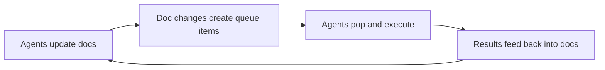
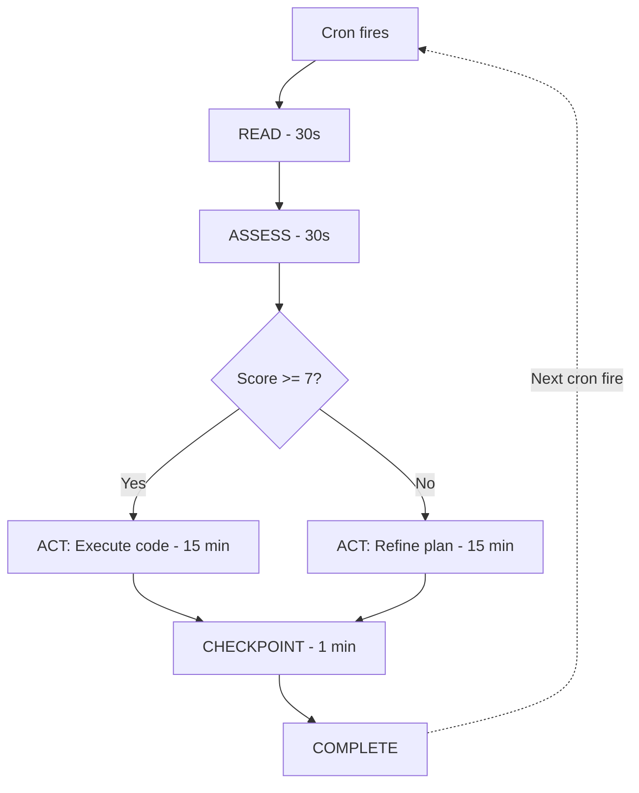
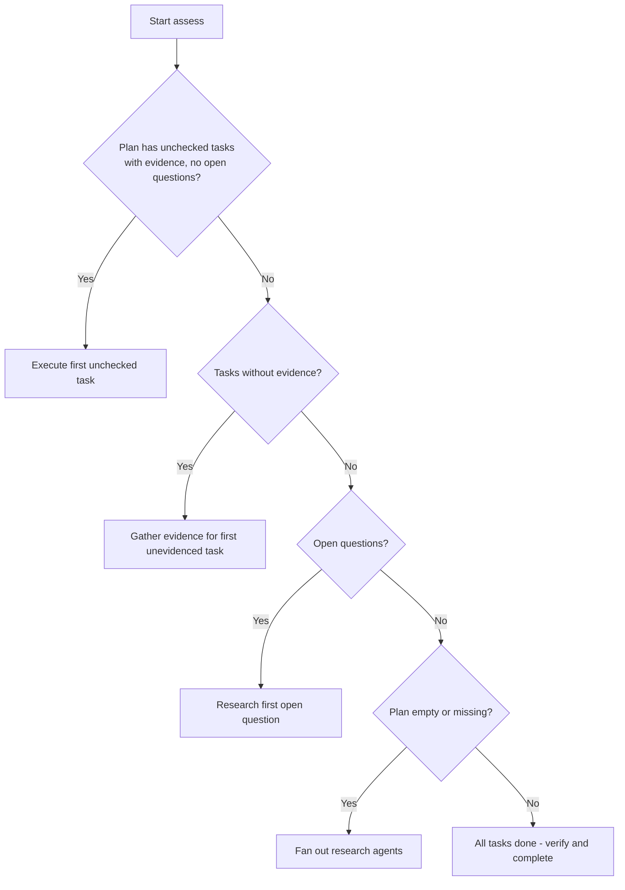
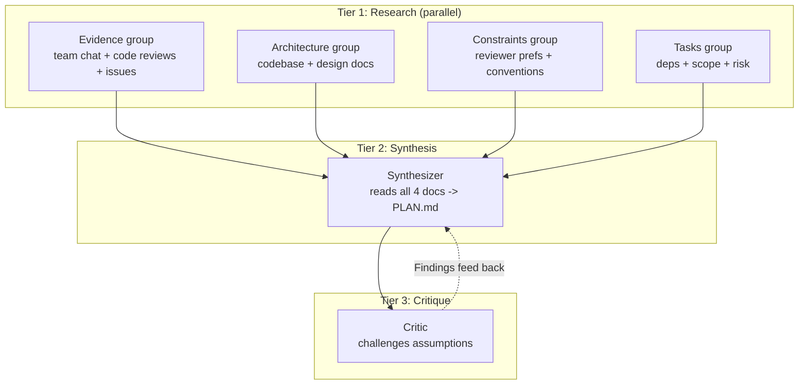
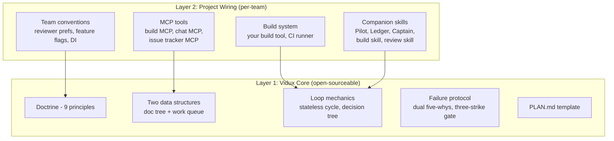
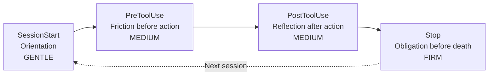

# Vidux Architecture Guide

> **The Redux of planned vibe coding.**
> The plan is the store. Code is the view. Work flows from plan changes.

Vidux is a plan-first orchestration system for AI-assisted coding on multi-day projects. It enforces unidirectional data flow -- evidence feeds the plan, the plan drives the code -- so that agent sessions can crash, restart, and resume without losing progress.

---

## 1. The Redux Analogy

This is not a loose metaphor. The structural mapping between Redux and Vidux is load-bearing. Understanding it is the fastest way to internalize the entire system.

In Redux, a UI store holds application state. Components render views derived from that state. State mutations happen only through dispatched actions, processed by reducers. Vidux does the same thing, but the store is a markdown file and the view is code.

| Redux Concept | Vidux Equivalent | Why the Mapping Holds |
|---------------|-----------------|----------------------|
| Store | PLAN.md | Single source of truth. All state lives here. |
| Actions | Plan amendments (require evidence) | The only legal way to mutate the store. Each must carry a payload (evidence). |
| Reducers | Gather + synthesize + critique | Pure functions that transform evidence into plan state. |
| View | Code (derived, never independent) | Rendered from the store. If the view is wrong, the store is wrong. |
| Dispatch | Must go through the plan | No direct mutations. Every code change traces back to a plan entry. |
| DevTools | Ledger (reconstruct any mission) | Append-only log. Replay any session. Time-travel debugging. |

The practical consequence is blunt: if the code is wrong, the plan is wrong. Fix the plan first, then fix the code. An agent that edits code without a corresponding plan entry is doing the equivalent of mutating Redux state outside a reducer -- a violation that makes the system unpredictable. The enforcement hooks (Section 7) exist to catch exactly this class of violation.

The analogy also explains why Vidux feels heavyweight for small tasks. Redux is overkill for a counter app. Vidux is overkill for a single-file bug fix. Both pay off when state is complex enough that unmanaged mutations create chaos.

---

## 2. Two Data Structures

Vidux has exactly two data structures. Everything else is derived.

```
┌─────────────────────────┐         ┌─────────────────────────┐
│  DOC TREE (the store)   │         │  WORK QUEUE (FIFO)      │
│                         │         │                         │
│  PLAN.md                │ ──edit─▶│  ┌───┬───┬───┬───┐      │
│  evidence/              │         │  │ 1 │ 2 │ 3 │...│ hot  │
│  constraints/           │         │  └───┴───┴───┴───┘      │
│  decisions/             │         │  (last 30 items)        │
│  investigations/        │         │  ──────────────         │
│                         │◀──pop── │  cold: git history      │
└─────────────────────────┘  result └─────────────────────────┘
        ▲                                     │
        │                                     ▼
        │                          ┌─────────────────────────┐
        └──── results write back ──│  Agent executes one     │
                                   │  item, verifies, dies   │
                                   └─────────────────────────┘
```

The doc tree is the persistent store. The work queue is derived: doc edits create
queue items, agents pop them, execution results write back into the tree. Code is
never written outside this loop.

### Documentation Tree (the store)

A markdown-based tree of folders and docs. This is the single source of truth. All knowledge, plans, evidence, and decisions live here.

```
vidux/
  PLAN.md              -- purpose, tasks, constraints, decisions
  evidence/            -- cached MCP queries, codebase analysis, stakeholder research
  constraints/         -- reviewer preferences, team conventions, architecture rules
  decisions/           -- what was decided, alternatives, rationale
```

Changes to the documentation tree are the PRIMARY work product. Code changes are SECONDARY. A cycle that improves the plan but writes zero code is productive. A cycle that writes 500 lines without updating the plan is a liability.

### Work Queue (FIFO, sliding window)

A queue of work items produced by documentation changes. When a doc changes, it creates a work slice in the queue.

```
Hot window:  last 30 items (always in context, always queryable)
Cold storage: item 31+ (in git history, retrievable but not loaded)
```

In v2, an `investigations/` directory lives alongside `evidence/` in the doc tree. When a task is promoted to a compound investigation (multiple tickets on the same surface, unclear root cause, or three-strike escalation), its research and analysis live in `investigations/<slug>.md` rather than inline in PLAN.md. This keeps the plan scannable while giving deep-dive analysis a durable home that any future agent can read.

Why FIFO: tasks have dependencies, and a stack (LIFO) would cause agents to work on the newest item first, which is almost never the right priority. FIFO aligns with dependency ordering.

Why 30 items: a token budget constraint. Thirty task entries with evidence citations fit in a single context window without crowding out working code. Beyond 30, items move to cold storage (git history) -- retrievable on demand but not loaded by default.

### Unidirectional Flow



Agents never "just code." They either update docs (which creates queue items) or pop queue items (which were created by doc updates). Every code change has a provenance chain: evidence led to a plan entry, the plan entry created a queue item, the queue item was executed as code. If you cannot trace a code change back through this chain, it is an unmanaged mutation.

---

## 3. The Core Six Principles

Non-negotiable doctrine. Each exists because a specific failure mode was observed in real multi-session AI coding projects. These six are the short form (also in `DOCTRINE.md`); `SKILL.md` adds three more (investigations, harnesses, subagents) that apply only when the situation calls for them.

**1. Plan is the store.** PLAN.md is the single source of truth. Code is a derived view. If the code contradicts the plan, the plan needs fixing first. SlopCodeBench (arxiv 2603.24755) demonstrates that agent code degradation is monotonic -- agents drift, they do not suddenly break. By cycle 10, code bears little resemblance to the original intent. Making the plan the store forces reconciliation every cycle, catching drift before it compounds.

**2. Unidirectional flow.** The cycle is Gather, Plan, Execute, Verify, Checkpoint, Gather. No step is skippable. To change code in a way the plan does not specify, you must update the plan first. The cost of skipping a step is invisible in any single cycle but devastating over a multi-day project. If you cannot fill in the evidence field, you are not ready to plan. If you cannot pass the build gate, you are not ready to checkpoint.

**3. 50/30/20 split.** 50% plan refinement. 30% code. 20% last mile. If you are coding more than planning, you are doing it wrong. This ratio was derived from the swiftify-v4 Combine rework, where 80/20 code-to-plan produced three full reworks when late-discovered constraints invalidated prior code. Inverting the ratio eliminated rework on subsequent projects.

**4. Evidence over instinct.** Every plan entry must cite at least one evidence source: MCP query, codebase grep, design doc, or team convention. No source means no entry. Gathering evidence adds 2-5 minutes per task. A wrong assumption costs 15-60 minutes of rework plus ripple effects. The evidence requirement front-loads cost where it is cheapest to pay.

**5. Design for completion.** Every dispatch will end. Context will be lost. Auth will expire. But the store persists. Therefore: state lives in files, every cycle reads fresh, checkpoints are structured, and any agent can resume from the last checkpoint. Tool state (.claude/, .cursor/) never lives inside the repo. A 20-minute cron fire does not get to assume it will get a 21st minute. The checkpoint at the end of each cycle is not optional bookkeeping -- it is the only thing that survives.

**6. Process fixes over code fixes.** Every failure produces two artifacts: a code fix (the immediate repair) and a process fix (a new constraint, test, hook, or skill update). The process fix is the valuable output because it makes the system smarter for next time. Research on multi-agent error propagation shows 17x error amplification when agents lack hierarchical correction -- a single bad assumption propagates through dependent tasks exponentially. Process fixes break this amplification chain by adding constraints that prevent the same class of error from recurring.

---

## 4. The Stateless Cycle

Every cron fire (20-minute or hourly) runs a fresh, stateless agent through five steps. The agent that wakes up has no memory of the previous agent. It knows nothing except what is in the files.



### Read (30s)

Read PLAN.md, `git log --oneline -10`, `git diff --stat`, and the last ledger entry. If uncommitted work exists from a crashed session, commit it first. This crash recovery comes from GSD's stuck-loop detection pattern.

### Assess (30s)

Run the plan readiness checklist (10-point scoring). Five required items must all be true; five quality items add one point each. Score 7+ to proceed to code; below 7, spend the cycle on plan refinement.

In v2, the decision tree checks two things before anything else: (1) **`[in_progress]` resume priority** -- if a task was marked in-progress by a previous cycle that died mid-execution, it is resumed first, before any new task selection; (2) **per-task Q-gating** -- each task's quality gate (build passes, tests pass, evidence cited) must be satisfied before the task can be marked complete. A task that was executed but failed its Q-gate stays `[in_progress]` and gets priority on the next cycle.

The decision tree:



### Act (15 min)

Either refine the plan or execute one task. Never two. One task per cycle prevents half-finished work.

### Checkpoint (1 min) then Complete

Structured commit: what changed, which task, what is next, blockers. Update PLAN.md Progress. Session ends. No state in memory. Next cron fire reads fresh.

### Timing Budget

| Step | Time | Notes |
|------|------|-------|
| Read | 30s | File reads are fast |
| Assess | 30s | Decision is simple if plan is good |
| Act (plan refinement) | 15 min | Research agents + synthesis |
| Act (code execution) | 15 min | One task + build/test |
| Checkpoint | 1 min | Commit + progress update |
| Buffer | 3 min | Retries, errors, network latency |

If a task takes longer than 15 minutes, break it into sub-tasks. This is a hard constraint imposed by the cron interval.

---

## 5. The Fan-Out Pattern

A single agent querying team chat, then code reviews, then issue trackers, then the codebase serially would burn its entire cycle on evidence gathering. The fan-out pattern parallelizes this.



The shape of fan-out/fan-in is N independent files in, one merged file out, one critic on top:

```
            ┌──────────┐  ┌──────────┐  ┌──────────┐  ┌──────────┐
  TIER 1    │ Agent A  │  │ Agent B  │  │ Agent C  │  │ Agent D  │
  (parallel)│ team chat│  │ codebase │  │  rules   │  │  issues  │
            └────┬─────┘  └────┬─────┘  └────┬─────┘  └────┬─────┘
                 │             │             │             │
                 ▼             ▼             ▼             ▼
            evidence/A.md  arch/B.md   constraints/  tasks/D.md
                 │             │           C.md            │
                 └─────────────┴─────┬───────┴──────────────┘
                                     ▼
                             ┌───────────────┐
  TIER 2 (serial)            │  Synthesizer  │  reads all 4
                             │  -> PLAN.md   │  writes one
                             └───────┬───────┘
                                     ▼
                             ┌───────────────┐
  TIER 3 (serial)            │    Critic     │  challenges
                             │  -> findings  │  assumptions
                             └───────────────┘
```

Fan-out is parallel because the 4 research lanes never touch the same file. Fan-in is serial because merging conflicts requires one mind. Never have N agents write to the same file.

**Tier 1: Research groups (4 groups, all parallel).** Each group writes to its own doc. No shared files. No coordination overhead.

**Tier 2: One synthesizer reads all 4 docs and writes unified PLAN.md.** Single merge point. One agent resolves conflicts between groups and produces a coherent plan.

**Tier 3: One critic reads PLAN.md and challenges assumptions.** Checks consistency, identifies missing evidence, flags oversized tasks. Adapted from the adversarial-spec pattern.

**Why not 20 agents on one file.** Research shows coordination gains plateau at approximately 4 agents. Beyond that, merging conflicting edits and resolving semantic duplicates costs more than the marginal research value. The 17x error amplification finding applies: without hierarchy, each additional agent multiplies the probability of a bad assumption propagating unchecked. The three-tier hierarchy bounds this by funneling all output through a single synthesis point.

---

## 6. Compound Tasks & Investigations

Most tasks are atomic: one ticket, one fix, one cycle. But some problems resist atomic treatment. Compound tasks exist for these cases.

**When to use a compound task:**
- 2+ tickets touch the same surface (same file, same module, same API)
- Unclear root cause -- the symptom is known but the fix is not
- Three-strike escalation -- 3+ prior atomic fixes on the same surface without resolution

**The `[Investigation: ...]` marker.** In PLAN.md, a compound task is marked with `[Investigation: investigations/<slug>.md]` instead of a simple checkbox description. This tells the agent to read the investigation file before attempting any work.

**Investigation template.** Each investigation file follows a standard structure:
1. **Tickets** -- which issues/PRs/bugs are bundled
2. **Evidence** -- gathered data, MCP queries, codebase analysis
3. **Root Cause** -- the underlying problem (not the symptom)
4. **Impact Map** -- what else this root cause affects
5. **Fix Spec** -- the proposed fix, scoped to the root cause
6. **Tests** -- what must pass before the investigation is closed
7. **Gate** -- the Q-gate criteria specific to this investigation

The investigation file is the compound task's plan-within-a-plan. It prevents the failure mode where an agent applies a surface fix to one ticket, then another agent applies a contradictory fix to a related ticket, and a third agent reverts both.

---

## 7. Layer Separation

Vidux core is company-agnostic. Zero references to any internal tooling, build system, or team convention.



**Layer 1: Vidux Core** contains everything portable: doctrine, data structures, loop mechanics, failure protocol, PLAN.md template. If you open-source Vidux, only Layer 1 ships.

**Layer 2: Project Wiring** contains everything team-specific: MCP tools, build commands, conventions, companion skills. Layer 2 imports Layer 1 and maps abstract concepts to concrete tools.

**How to write your own Layer 2.** Replace the MCP tools with yours (GitHub API, Linear, Slack). Replace the build commands (Gradle, npm, make). Replace the companion skills with your equivalents. The core loop, doctrine, and data structures remain unchanged. PLAN.md is the interface contract -- any Layer 2 that can read and write a conformant PLAN.md is compatible.

---

## 8. The Enforcement Gradient

Vidux uses four Claude Code hooks, all prompt-type (nudge, not block).

Plan compliance is a judgment call -- the agent must compare semantic intent of a task against the content of an edit. A task that says "refactor shared helpers" might require editing `utils/helpers.ts`, which is not literally named in the plan. A command hook would hard-block this. Prompt hooks delegate the judgment to the agent while keeping it on rails.



The four hooks form a cascade with graduated pressure:

| Hook | Lifecycle Point | Doctrine Enforced | Question Asked |
|------|----------------|-------------------|----------------|
| **SessionStart** | Session begins | Design for completion | "Did you read the plan?" |
| **PreToolUse** | Before Write/Edit | Unidirectional flow | "Is this edit in the plan?" |
| **PostToolUse** | After Write/Edit | Unidirectional flow | "Did this edit match the plan?" |
| **Stop** | Session ends | Design for completion | "Did you checkpoint?" |

**Why the cascade works.** Each hook catches what the previous one missed. If the agent follows SessionStart (reads the plan, finds the current task), it rarely triggers PreToolUse because it already knows which files to edit. If it follows PreToolUse, it rarely triggers PostToolUse because the edit was planned. If all three hold, Stop is a formality.

**The four lifecycle points.** They map to the four moments where an agent is most likely to deviate: waking up (might skip the plan), before writing (might edit an unplanned file), after writing (might have drifted), and before dying (might forget to checkpoint). There is no fifth point that matters.

**Why prompt hooks not command hooks.** Command hooks return pass/fail. They work for objective checks (does the build pass, does the linter approve). They do not work for semantic checks (is this edit consistent with the intent of Task 4). That requires reading comprehension, not pattern matching. Prompt hooks inject a question and let the agent reason about it.

---

## 9. File Map

| File | Purpose |
|------|---------|
| `SKILL.md` | Master reference. Architecture, doctrine, loop, failure protocol, PLAN.md template, activation rules, companion skill table. |
| `DOCTRINE.md` | The 6 principles in concise form. Redux analogy table. Vidux-vs-Pilot decision matrix. |
| `LOOP.md` | Loop mechanics. Stateless cycle (5 steps), decision tree, fan-out pattern, readiness checklist (10-point scoring), timing budget, escalation statuses, stuck-loop detection, UNIFY step. |
| `ENFORCEMENT.md` | Hook design. 4 hooks (SessionStart, PreToolUse, PostToolUse, Stop), full JSON config, rationale for prompt-type over command-type, cascade principle. |
| `INGREDIENTS.md` | Design lineage. 10 patterns borrowed from open-source tools, with attribution and adoption details. |
| `PLAN.md` | Live plan for the Vidux skill itself (dogfooding). |
| `commands/vidux.md` | Slash command `/vidux` -- entry point, activates the full orchestration loop. |
| `commands/vidux-plan.md` | Slash command `/vidux-plan` -- plan-only mode, skips execution. |
| `commands/vidux-status.md` | Slash command `/vidux-status` -- shows current plan state and progress. |
| `commands/vidux-loop.md` | Slash command `/vidux-loop` -- create or refine a cron harness for unattended cycles. |
| `commands/vidux-dashboard.md` | Slash command `/vidux-dashboard` -- multi-project overview across active missions. |
| `commands/vidux-manager.md` | Slash command `/vidux-manager` -- top-level project management surface. |
| `commands/vidux-version.md` | Slash command `/vidux-version` -- print the installed Vidux version. |
| `hooks/hooks.json` | Hook configuration file for Claude Code integration. |
| `scripts/install-hooks.sh` | Installs Vidux hooks into the local Claude Code settings. |
| `scripts/vidux-checkpoint.sh` | Automates the checkpoint step (commit format, progress update). |
| `scripts/vidux-gather.sh` | Runs the fan-out evidence gathering pattern. |
| `scripts/vidux-loop.sh` | The cron driver. Runs the full Read, Assess, Act, Checkpoint, Complete cycle. |
| `scripts/vidux-doctor.sh` | Read-only health check — worktrees, automation topology, stale plans, merge conflicts. |
| `scripts/vidux-fleet-quality.sh` | Fleet-wide quality scan across active automations. |
| `scripts/vidux-prune.sh` | Archive stale projects and prune cold storage. |
| `scripts/vidux-install.sh` | Installer helper for the symlink + hook setup. |
| `tests/test_vidux_contracts.py` | Contract tests verifying that Vidux documentation is internally consistent. |
| `.claude-plugin/plugin.json` | Claude Code plugin manifest for skill discovery and activation. |

---

## 10. Design Lineage

Vidux synthesizes 10 patterns from 26 surveyed open-source tools, selected for pattern quality rather than star count. Full analysis lives in `INGREDIENTS.md`.

| # | Pattern | Source | What Vidux Took |
|---|---------|--------|-----------------|
| 1 | Phase chain (brainstorm-plan-execute-verify) | superpowers | Unidirectional flow. Each phase produces a durable artifact before the next begins. |
| 2 | Three-document chain (spec-plan-tasks) | spec-kit | PLAN.md structure. Spec, plan, and task list collapsed into one file for simpler git sync. |
| 3 | Stuck-loop detection + crash recovery | GSD | Three-strike escalation. Crash recovery via uncommitted work detection. |
| 4 | Execute/Qualify/Unify loop | PAUL | Four escalation statuses. The UNIFY step (reconcile planned vs actual). |
| 5 | Markdown-native coordination, git-backed state | tick-md | PLAN.md as a multi-agent task board. Git history as the persistence layer. Design for completion. |
| 6 | Multi-perspective review gate | claude-code-harness | Process fixes > code fixes. Ground reviews in real data (MCP queries), not generic checklists. |
| 7 | One-agent-per-criterion + judge layer | opslane/verify | Fan-out decomposition. Readiness checklist as a spec-interpreter pattern. |
| 8 | Dual-workflow routing | claude-code-spec-workflow | Vidux vs Pilot routing. Full orchestration for big work, lightweight mode for small work. |
| 9 | Research-before-planning | deep-plan | Evidence over instinct doctrine. Fan-out as scaled multi-source interview. |
| 10 | Adversarial debate for spec hardening | adversarial-spec | Tier 3 critic in fan-out. Dual five-whys in failure protocol. Surprises section. |

The most structurally influential source is tick-md (18 stars) -- a single markdown file in git is sufficient for multi-agent coordination. The most practically influential is GSD (46K stars), whose stuck-loop detection prevents the most common failure in unattended cron operation. The key rejected pattern was multi-LLM orchestration, which adds deployment complexity that conflicts with running locally with simple installation.

---

## Tradeoffs

**Overhead vs safety.** The 50/30/20 split means half the agent's time goes to planning. Vidux bets that plans are rarely right from the start, so front-loading plan refinement prevents rework that costs more than the planning overhead.

**Rigidity vs flexibility.** The unidirectional flow is inflexible by design. Drive-by edits to unrelated files are how codebases accumulate untracked changes that interact in surprising ways three sessions later.

**One task per cycle vs throughput.** Half-finished tasks leave the codebase in an intermediate state the next agent must diagnose. One complete task per cycle means the codebase is always in a known-good state at each checkpoint.

**Solo computer workflow.** Vidux is designed for one human operating one or more AI agents on a local machine. Tool state (.claude/, .cursor/) lives outside the repo. The repo is the shared surface; tool configuration is per-operator.