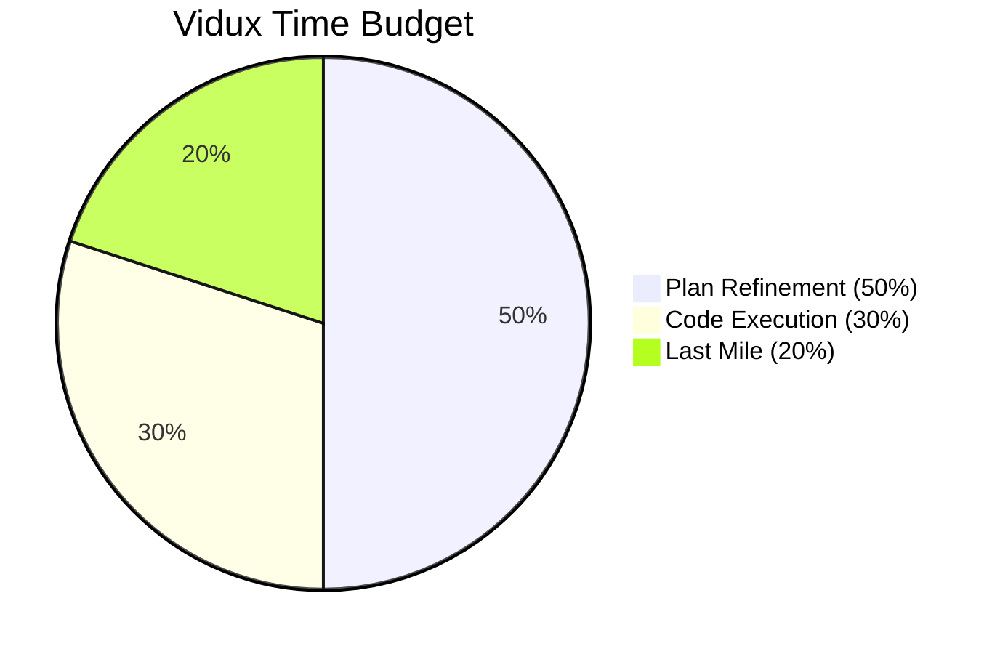
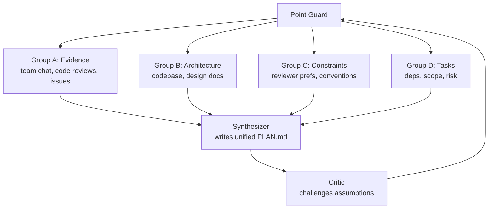
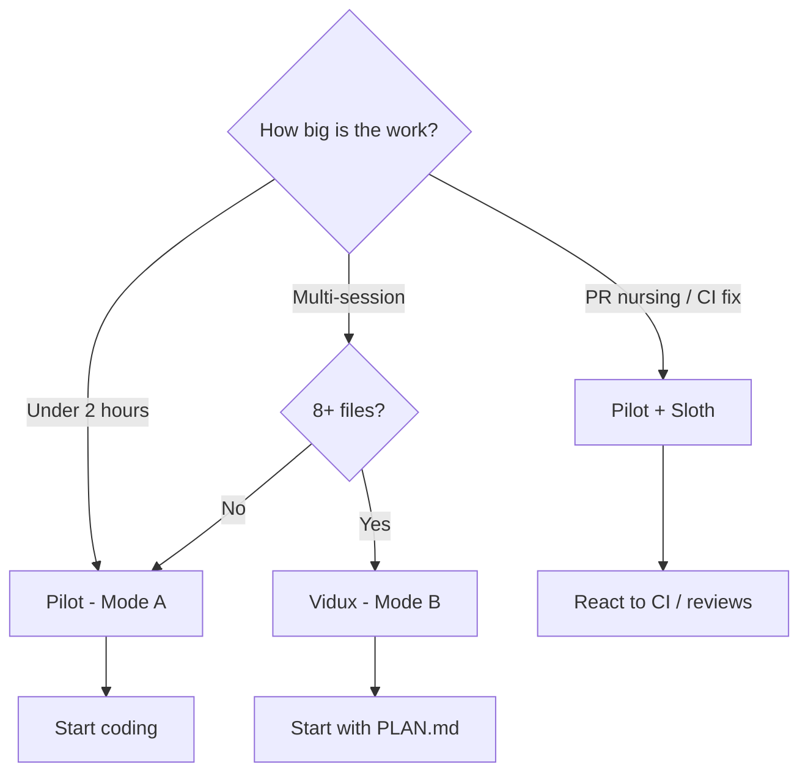
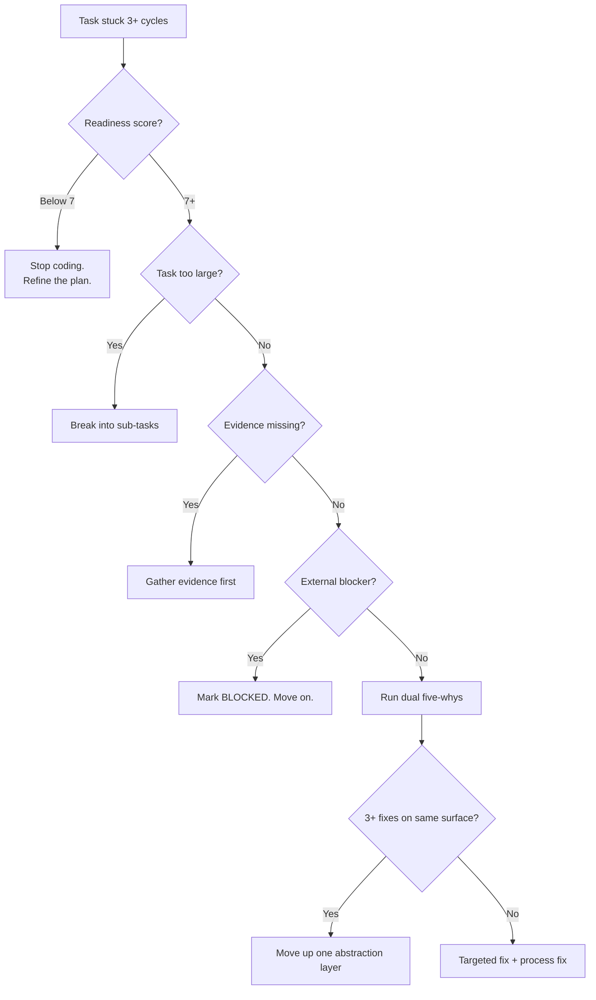
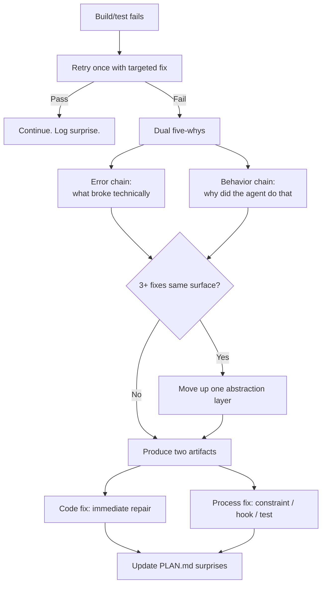

# Vidux Best Practices

Lessons from 9 overnight cron cycles where Vidux built itself.
This is not theory. Everything here was learned the hard way.

---

## 1. Writing a Good PLAN.md

The plan is the single most important artifact. Not the code. The plan. If the
plan is wrong, everything downstream is wrong.

**Purpose:** One paragraph, user-visible goal only. No implementation details.
The Vidux build plan says: "Create a net-new plan-first orchestration system
that makes quarter-long iOS projects completable in a week via overnight cron
loops." No mention of hooks, scripts, or files. Just the outcome.

**Evidence** is the backbone. Every bullet cites a source with `[Source: ...]`.
No source means it is a guess. Remove it or go find evidence.

Good evidence entry:
```
- [Source: SlopCodeBench, arxiv 2603.24755] Agent code degradation is monotonic.
  Erosion in 80% of trajectories. "Coding while thinking" is empirically bad.
```
Specific, citable, actionable. Directly informs the 50/30/20 split.

Bad evidence entry:
```
- Agents probably drift from the plan over time. We should add checks.
```
No source. "Probably" means guessing. Does not belong in the plan.

**Constraints** use the ALWAYS / ASK FIRST / NEVER format:
- ALWAYS: invariants. "ALWAYS work across Claude Code, Cursor, and Codex."
- ASK FIRST: human-gated. "ASK FIRST before changing installer or bootstrap behavior."
- NEVER: hard prohibitions. "NEVER run more than 4 coding agents in parallel."

Include reviewer preferences grounded in real PR comments. The Vidux plan has:
"Reviewer preference: Sports analogies (point guard, ref), not
political ones (mayor)." That came from actual feedback.

**The 10-point readiness checklist** (from LOOP.md). Score 7+ to code:

Required gates (all must be true, or score is 0):
1. Purpose section filled
2. Evidence has 3+ cited sources with `[Source:]` markers
3. Constraints has at least one ALWAYS and one NEVER
4. At least one Task with evidence cited
5. No Open Questions blocking the next task

Quality points (each adds 1):
6. Evidence includes an external source (not just codebase greps)
7. Constraints include a stakeholder preference
8. Tasks have `[Depends:]` markers where applicable
9. Decisions section has an entry with alternatives and rationale
10. No vague task descriptions

**Compound tasks (v2).** When a task bundles multiple tickets or requires deep root-cause analysis, mark it with `[Investigation: investigations/<slug>.md]` instead of a plain description. This tells the agent to read the investigation file before starting work. The investigation file contains the bundled tickets, gathered evidence, root cause, impact map, fix spec, and gate criteria. See the architecture guide (Section 6) for the full template.

**What happens when you skip this:** The swiftify-v4 session coded without
capturing team conventions. Result: a Combine-based implementation reworked
because the team preferred async/await. A 30-minute evidence pass through
PR reviews would have caught it. The plan scored maybe 4/10 -- Purpose existed
but Evidence had zero external sources and Constraints had no stakeholder
preferences. The checklist would have blocked coding.

---

## 2. The 50/30/20 Rule



50% refining the plan. 30% writing code. 20% last mile (build errors, CI,
reviewer feedback, merges).

**If you are coding more than planning, stop.** SlopCodeBench shows agent code
degradation is monotonic -- erosion in 80% of trajectories. The longer you code
without grounding in evidence, the further you drift.

The Vidux build itself: of 16 cycles, 9 were plan refinement, 4 were code
execution, 3 were last mile. That is roughly 56/25/19 -- and the build shipped
clean. The swiftify-v4 session inverted this ratio. Heavy coding, light
planning. The result was a Combine rework that burned multiple cycles.

---

## 3. Fan-Out Research Pattern

Never have 20 agents write one file. Research shows 17x error amplification
beyond 4 parallel agents without hierarchy.



**Tier 1 -- Research:** 4 research agents, all parallel. Each writes
to its own file (evidence.md, architecture.md, constraints.md, tasks.md).

**Tier 2 -- Synthesis:** One agent reads all four outputs, writes unified
PLAN.md. Single writer, no conflicts.

**Tier 3 -- Critique:** One agent challenges assumptions, checks for
contradictions and scope creep.

For code execution, cap at 4 parallel agents with a point guard plus workers
model. Research agents scale wider because they are read-only -- no merge
conflicts. The Vidux build ran 9 research agents in Cycle 0 and 5 swarm agents
in Cycle 3, all successfully.

Why subagents, not Teams? Teams persist across sessions (violates stateless
doctrine), add coordination overhead, and risk orphaned state if the cron dies.
Subagents are fire-and-forget.

---

## 4. Running Overnight Cron Loops

Each cycle is stateless: gather, plan, execute, verify, checkpoint, complete. The next
cycle is a fresh dispatch that knows nothing except what is in the store.

**Hourly > 20-minute for overnight.** Twenty-minute cycles create thrashing --
the agent barely finishes reading context before checkpoint time. Hourly gives
room for meaningful work. Use 20-minute only for daytime rapid iteration.

**Expect auth expiry.** Tokens expire, MCP servers disconnect. A crashed session
loses at most one cycle. The next cycle commits recovered work first.

**Commit is the checkpoint, not push.** Solo computer workflow. Commit after
every cycle. Push when ready to share. Commit message: `vidux: [what you did]`
with structured body (Plan, Evidence, Next, Blocker).

**Environment variables for ledger:** `AGENT_LANE` (work track) and
`AGENT_SKILLS` (loaded skills, e.g., `vidux,build-skill,review-skill`).

---

## 5. Common Mistakes

**Coding without a plan entry.** Number one mistake. Every code change traces to
a PLAN.md task. The PreToolUse hook reminds you, but it is a safety net, not a
substitute. During the Vidux build, agents kept making "quick cleanups" to
unplanned files. Each cleanup was small. The cumulative drift was not. That is
why the drift detection hook was added.

**Carrying context between sessions.** The next agent remembers nothing. Write
it to PLAN.md or it does not exist. The Vidux build logged 5 surprises across
16 cycles. Each one changed subsequent behavior -- because it was written down.

**Too many parallel coding agents.** Four is the cap. 17x error amplification
without hierarchy. Use point guard plus workers. Research agents can go wider
(read-only, no merge conflicts).

**Forgetting to checkpoint.** No commit means the next session starts blind.
Even plan-only refinement gets a commit: `vidux: refined evidence for Task 3`.

**Plan without evidence.** An uncited entry is a guess. The readiness checklist
requires 3+ cited sources to start coding. A 4/10 plan should never produce code.

**Over-engineering enforcement.** Prompt hooks for judgment calls. Command hooks
for objective checks (compile, lint). Plan compliance is a judgment call -- a
command hook parsing PLAN.md for file paths is brittle. A prompt hook that
reminds the agent to check is flexible and effective.

---

## 6. When to Use Vidux vs Pilot



**Vidux (Mode B):** Multi-day features, 8+ files, quarter-long projects, work
spanning multiple sessions. The plan makes handoff possible.

**Pilot (Mode A):** Bug fixes, single-file changes, under 2 hours. No plan
overhead.

**Pilot + Sloth:** PR nursing -- CI fixes, review responses, issue tracker SLA triage.
Reactive and bounded.

**Rule of thumb:** "Will a second agent need to pick this up later?" If yes,
Vidux. The Vidux build decided this explicitly: "Two modes -- Pilot for Mode A,
Vidux for Mode B. Don't try to make one system do both."

---

## 7. Debugging a Stuck Plan



**Most common cause:** Plan was not ready and agents are flailing. Check the
readiness score first. Below 7 means stop coding and refine.

**Stuck-loop detection** (from LOOP.md, borrowed from GSD): same task in 3+
consecutive cycles means one of three things -- task is too large (break it),
evidence is missing (gather it), or it is externally blocked (mark it BLOCKED).

**Dual five-whys:** Two separate chains on every failure. Why did the error
happen (technical root cause)? Why did the agent make that mistake (process
root cause)? The second chain is more valuable -- it produces process fixes.

Real example: Phase 4 (plugin packaging) was treated as required. Cycle 7
discovered SKILL.md alone is the cross-tool format -- plugins are for
marketplace distribution only. Surprise logged: "Phase 4 was over-engineered."
The behavior five-whys: Why did we build it? Assumed plugins were needed. Why?
Did not research agentskills.io first. Process fix: always research existing
standards before building new packaging.

**Three-strike gate:** 3+ fixes on the same surface without resolution means
the problem is in the design, not the code. Stop patching. Move up one
abstraction layer.

---

## 8. The Failure Protocol

From Jeffrey Lee-Chan's harness engineering pattern.



**Step 1:** Retry once. Not a blind re-run -- read the error, form a hypothesis,
apply a specific fix.

**Step 2:** If retry fails, dual five-whys. The error chain finds what broke.
The behavior chain finds why the agent made the mistake. The behavior chain is
arguably more important -- it tells you what to fix in the process.

**Step 3:** Three-strike check. 3+ fixes on the same surface means the design
is wrong, not the code.

**Step 4:** Every failure produces two artifacts. A code fix (table stakes) and
a process fix (the valuable output). The process fix could be an updated
constraint, a new hook, a new test, or a skill update. Over 16 cycles, the
Vidux build produced the drift detection hook, the checkpoint enforcement hook,
and the three-strike gate itself -- all from failures that were analyzed, not
just patched.

**Step 5:** Add a Surprise entry to PLAN.md with both root causes and the
process fix. The next agent reads it and avoids the same trap.

---

## 9. Quick Reference

**Before coding:** Readiness score 7+? If not, refine the plan.

**Before editing a file:** Covered by a PLAN.md task? If not, update plan first.

**Before checkpoint:** Progress section updated? Tasks checked off? Committed?

**Before stopping:** Can a stranger pick up from the files alone?

**On failure:** Retry once. Dual five-whys. Three-strike check. Always produce
a process fix alongside the code fix.

**On stuck plan:** Readiness score. Break large tasks. Gather missing evidence.
Mark blockers. Escalate with five-whys.

**Commit is the checkpoint.** Not push. Every cycle. Always.

---

## 10. When to Investigate vs When to Just Fix

Not every task needs a compound investigation. Most do not. Use this decision tree:

```
Is it a single obvious fix with a known root cause?
  → Atomic task. One checkbox, one cycle, done.

Are 2+ tickets hitting the same surface (file, module, API)?
  → Compound. Bundle them into one investigation so fixes do not contradict.

Have 3+ prior atomic fixes already been attempted on this surface?
  → Compound with full impact map. The design is wrong, not the code.
    Map everything the root cause touches before writing a fix.

Is the root cause unclear — you know the symptom but not the why?
  → Compound. Gather evidence first. The investigation file is where
    you work out the root cause before committing to a fix direction.
```

When in doubt, start atomic. If the first fix fails its Q-gate or a second ticket arrives on the same surface, promote to compound. The `[Investigation: ...]` marker in PLAN.md and the corresponding file in `investigations/` can be added at any point -- you do not need to decide upfront.
