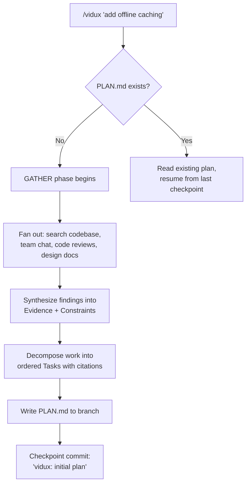
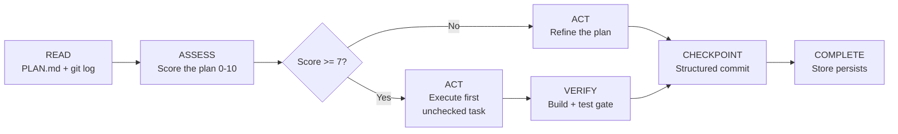
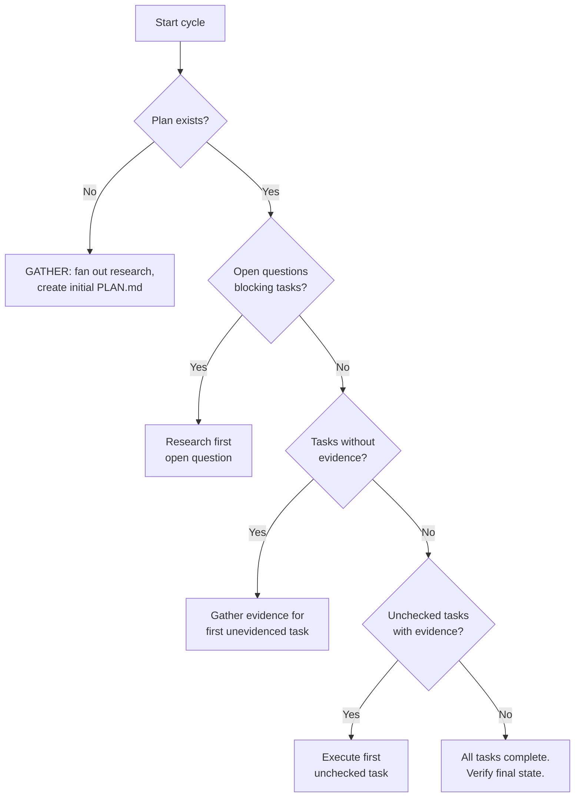

# Vidux Quickstart

## 60-Second Path

Clone, symlink, run. That's it.

```bash
git clone git@github.com:leojkwan/vidux.git
ln -sfn $(pwd)/vidux ~/.claude/skills/vidux     # Claude Code
ln -sfn $(pwd)/vidux ~/.cursor/skills/vidux     # Cursor
ln -sfn $(pwd)/vidux ~/.codex/skills/vidux      # Codex
```

Then in Claude Code, Cursor, or Codex:

```
/vidux "add offline caching to the feed"
```

That first cycle is **GATHER only** — no code is written. The agent fans out research (codebase, team chat, code reviews), synthesizes findings, and writes a `PLAN.md`. Read the plan, steer it, then run `/vidux` again to start executing tasks one cycle at a time.

Skip ahead to [Your First /vidux Run](#your-first-vidux-run) if you want the step-by-step. Read [What Vidux Is](#what-vidux-is) for the why.

## What Vidux Is

Here is the problem Vidux solves: you sit down with an AI agent, describe a big feature, and it starts coding immediately. Three hours later you have 2,000 lines of code, half of it wrong, built on assumptions nobody validated. You have no plan, no evidence trail, and no way for a different agent (or future-you) to pick up where this one left off. The code drifted from the spec because there was no spec. The agent was thinking and coding at the same time, which is like drawing a map while driving.

Vidux separates the thinking from the doing.

The name is "Vibe + Redux," and the Redux analogy is load-bearing. In Redux, the store is the single source of truth. Components (the view) are derived from the store -- they never hold independent state. If the view is wrong, you fix the store, and the view re-renders.

Vidux works the same way:

| Redux | Vidux |
|-------|-------|
| Store | PLAN.md (docs, evidence, decisions) |
| Actions | Plan amendments (must cite evidence) |
| Dispatch | Must go through the plan -- no direct code edits |
| View | Code (derived from plan entries, never independent) |
| DevTools | Git log + Ledger (reconstruct any mission from history) |

**The plan is the store. Code is the view.** If the code is wrong, the plan is wrong. Fix the plan first, then fix the code. An agent should never "just code" -- it either updates the plan (which creates work items) or executes a work item (which was created by a plan update). That unidirectional flow is the whole trick.

This matters most for work that spans multiple sessions. Context dies between sessions. Auth expires. Machines change. But PLAN.md is a file in a git branch. Any agent can read it, understand the state of the world, and pick up exactly where the last one stopped. No databases, no running processes, no memory tricks.

## Installation Details

### Prerequisites

- `vidux` repo cloned locally
- One of: Claude Code, Cursor, or Codex

### Symlink to your tools

Replace `/path/to/vidux` with your actual clone path.

```bash
ln -sfn /path/to/vidux ~/.claude/skills/vidux
ln -sfn /path/to/vidux ~/.cursor/skills/vidux
ln -sfn /path/to/vidux ~/.codex/skills/vidux
```

### Optional: install enforcement hooks

```bash
bash scripts/install-hooks.sh /path/to/your/project
```

The hooks inject gentle reminders into the agent's context at key moments -- read PLAN.md before writing code, check file scope against the plan, checkpoint before exiting. They are training wheels, not guardrails. A well-practiced agent does these things naturally. Install them if you are new to Vidux or onboarding a teammate; skip them once the habits are internalized.

### What you have after install

```
~/.claude/skills/vidux ──┐
~/.cursor/skills/vidux  ──┼──▶  /path/to/vidux  (one clone, three symlinks)
~/.codex/skills/vidux   ──┘
                                 │
                                 ├── SKILL.md          ← full contract (9 doctrine)
                                 ├── DOCTRINE.md       ← short doctrine (6 core)
                                 ├── LOOP.md           ← stateless cycle
                                 ├── commands/         ← /vidux, /vidux-plan, /vidux-status
                                 ├── scripts/          ← loop, checkpoint, gather, doctor
                                 ├── hooks/            ← optional prompt hooks
                                 ├── guides/vidux/     ← quickstart, architecture, best practices
                                 └── projects/         ← per-project PLAN.md lives here
                                       └── <my-mission>/
                                             ├── PLAN.md
                                             ├── evidence/
                                             └── investigations/
```

One clone, multi-tool symlinks. Plans live in `projects/<mission>/`, never in the target repo's working tree.

## Your First /vidux Run

Run `/vidux "your project description"` in Claude Code (or Cursor/Codex). Here is what happens step by step.

The first cycle is always GATHER. No code is written. The agent's entire job is to understand the landscape and produce a plan worth executing.



When it finishes, you have a `PLAN.md` with these sections:

- **Purpose** -- one paragraph on why the project exists, written for a human reader.
- **Evidence** -- cited sources. Team chat messages, PR comments, codebase greps with file paths and line numbers, design doc quotes. Every claim has a receipt.
- **Constraints** -- ALWAYS / ASK FIRST / NEVER rules. What must be true, what needs human sign-off, what is forbidden.
- **Decisions** -- what was decided, what alternatives were considered, and the rationale. Future agents can read the "why" without guessing.
- **Tasks** -- ordered, checkboxed, each citing its evidence. Dependency markers (`[Depends: Task N]`) and parallelization markers (`[P]`). Compound tasks use `[Investigation: investigations/<slug>.md]`.
- **investigations/** -- directory for compound task analysis (may not exist if all tasks are atomic). Each file contains bundled tickets, evidence, root cause, impact map, fix spec, and gate criteria.
- **Open Questions** -- unknowns that need research before tasks can proceed.
- **Surprises** -- unexpected findings discovered during execution. Timestamped.
- **Progress** -- living log updated each cycle. The breadcrumb trail.

Read this plan carefully. It is the most important artifact Vidux produces. The code that follows is just the plan rendered into Swift (or TypeScript, or whatever your project uses).

## The Stateless Cycle

Every subsequent `/vidux` run follows the same five-step cycle. The agent wakes up with no memory, reads the files, does one thing, writes a checkpoint, and dies.



**READ** (30 seconds). Open PLAN.md. Check `git log --oneline -10` for recent commits. Check `git diff --stat` for uncommitted work from a crashed session. If there is uncommitted work, commit it as crash recovery before doing anything else.

**ASSESS** (30 seconds). Score the plan on a 10-point readiness checklist. Five required items (purpose filled, 3+ cited evidence sources, at least one ALWAYS and one NEVER constraint, at least one task with evidence, no open questions blocking the next task). Five quality items (external evidence source, stakeholder preference, dependency markers, at least one decision with alternatives, no vague task descriptions). If the score is below 7, the cycle refines the plan instead of writing code. This is how the 50/30/20 budget gets enforced -- not by willpower, but by a gate.

**ACT** (bulk of the cycle). Either refine the plan (gather evidence, answer open questions, decompose tasks) or execute the first unchecked task with evidence. One task. Not two. Never two. If the next task has an `[Investigation: investigations/<slug>.md]` marker, read the investigation file first -- it contains bundled tickets, root cause analysis, and a fix spec that scopes the work.

**CHECKPOINT** (30 seconds). Structured git commit: what changed, what is next, any blockers. Update the Progress section of PLAN.md. Git commit is the checkpoint, not git push. Push when ready.

**COMPLETE**. The dispatch completes. The store (PLAN.md) persists. The next agent that runs `/vidux` rehydrates from files and picks up from the checkpoint. This is the "design for completion" principle -- the store survives, the dispatch doesn't.

### The Decision Tree

When the agent wakes up, the priority logic is simple:



Notice the ordering. Open questions are resolved before unevidenced tasks, which are filled in before code execution. The system biases toward understanding over action. That is the whole point.

## Commands

**`/vidux`** -- Full cycle. Gather, plan, execute, verify, checkpoint. This is the command you will use 90% of the time. Pass arguments to give direction: `/vidux "add offline caching to the feed"` or `/vidux "focus on the migration tasks"`.

**`/vidux-plan`** -- Plan-only mode. Creates or refines PLAN.md but never writes code. Use this when you want to iterate on the plan with the agent before any code is touched. Good for the first few cycles of a new project, or when you come back from a meeting with new constraints. Example: `/vidux-plan "refine the migration strategy based on Jon's review feedback"`.

**`/vidux-status`** -- Read-only one-screen summary. Shows task completion percentage, current blockers, open questions, and the last few Progress entries. Use this to check in without triggering a cycle. Good for standups, or when you want to see where things are before deciding what to do next.

**`/vidux-loop`** -- Set up or refine a cron harness for unattended cycles. The harness encodes the end goal and project DNA; PLAN.md holds the state. See `vidux-loop.md` for the full pattern.

**`/vidux-dashboard`** -- Multi-project overview. Useful when you have several Vidux missions in flight and want one-screen visibility across all of them.

## The 50/30/20 Rule

This is the most counterintuitive part of Vidux, and the most important.

- **50% plan refinement** -- gathering evidence, synthesizing, pruning, updating PLAN.md
- **30% code** -- derived from plan entries, one task per cycle
- **20% last mile** -- build errors, CI gates, reviewer feedback, things outside the closed loop

If you look at a project's git history and more than 30% of the commits are code changes, the plan was not good enough. You were coding on assumptions instead of evidence.

The swiftify-v4 project proved this. The first three days were almost entirely plan refinement -- grepping the codebase for ObjC boundary methods, cataloging every `@objc` annotation, mapping dependency chains, gathering reviewer preferences from past PR comments. By the time the first line of Swift was written, the agent knew exactly which 23 methods the boundary shell needed to expose, which patterns the tech lead preferred, and which files were off-limits. The code phase was boring. Mechanical. That is the goal. Boring code means the hard thinking already happened in the plan.

When you find yourself wanting the agent to "just start coding" -- that is the moment to stop and ask what evidence is missing. The plan is doing its job when the code writes itself.

## Running Overnight

Vidux can run as a cron loop. Each fire is a fresh agent with no memory.

```bash
bash scripts/vidux-loop.sh /path/to/your/project
```

The loop script fires `/vidux` on an interval (default 20 minutes). Each cycle reads PLAN.md, picks the next action, executes it, checkpoints, and exits. The next cron fire is a completely new agent. It has never heard of the previous one. It just reads the files.

This is the "design for completion" principle made literal. There is no daemon, no long-running process, no state accumulating in memory. PLAN.md is the entire state of the world. Git is the bus. If an agent crashes mid-cycle, the next one will see the uncommitted work in `git diff`, commit it as crash recovery, and continue from there.

A solo computer workflow: kick off the loop before bed, review the Progress section in the morning. Each commit tells you what happened, what is next, and what is blocked. The plan file IS the debugger -- you can read exactly why the agent made every decision, because every decision cites its evidence.

Each cycle is self-contained. The plan file IS the state. No databases, no running processes, no memory between cycles.
