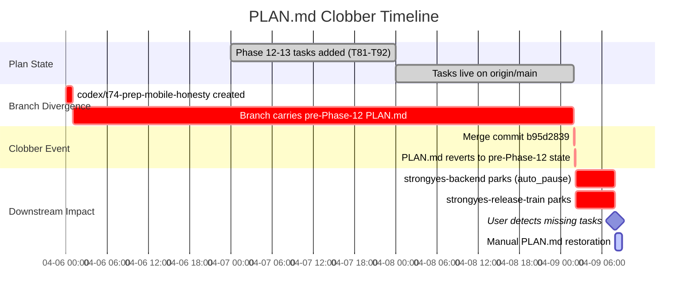
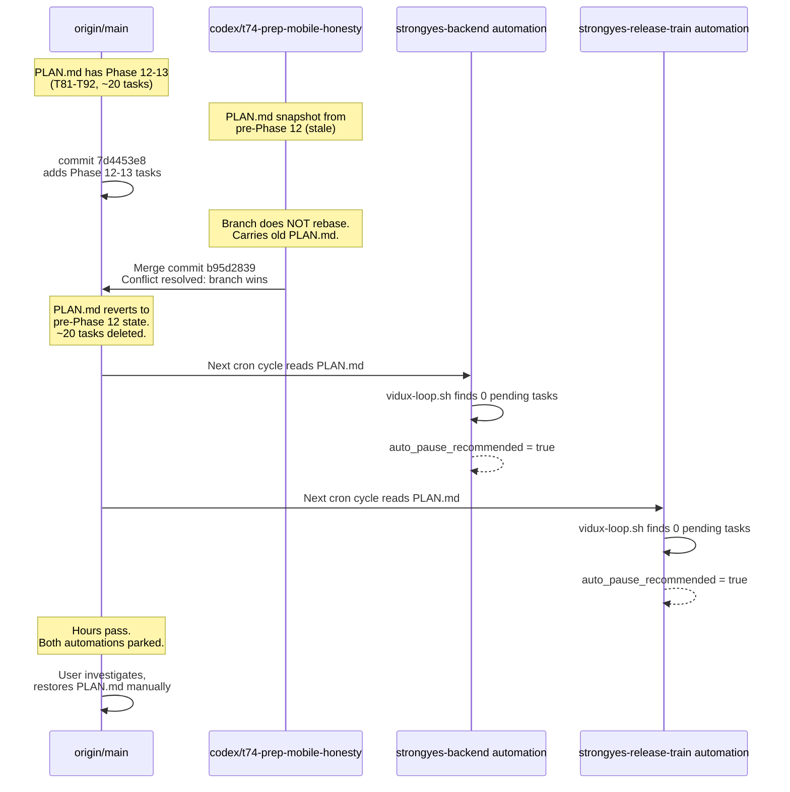

# Postmortem: PLAN.md Merge Clobber in strongyes-web

**Date:** 2026-04-09
**Severity:** High -- two automations parked, ~20 tasks worth of plan state deleted
**Detection:** Manual (user investigation)
**Time to restore:** Hours (manual)

---

## Incident Summary

A git merge in `strongyes-web` (commit `b95d2839`) resolved a PLAN.md conflict in favor of a stale branch version, deleting approximately 20 tasks spanning Phase 12 and Phase 13 (T81-T92). Two automations (`strongyes-backend`, `strongyes-release-train`) subsequently parked with `auto_pause_recommended` because their queued and in-progress tasks no longer existed in the plan.

---

## Incident Timeline





---

## Root Cause Analysis

**Primary cause:** PLAN.md has no special merge protection. It is treated like any other file during git merge conflict resolution. When the branch `codex/t74-prep-mobile-honesty` was merged, the conflict on PLAN.md was resolved by accepting the branch version -- which predated two full phases of task additions.

**Why PLAN.md is uniquely vulnerable in worktree-based execution:**

PLAN.md is the single source of truth for the entire automation fleet (Doctrine 1: "Plan is the store"). Unlike code files, where a merge clobber produces a build failure that is immediately detectable, a PLAN.md clobber produces a _silent_ state regression. The file is still valid Markdown. It still parses correctly in `vidux-loop.sh`. It just contains fewer tasks -- and `vidux-loop.sh` has no mechanism to detect that tasks _disappeared_.

The worktree execution model (Doctrine 15, SKILL.md line 420) creates N branches that each carry a snapshot of PLAN.md at branch-creation time. If any branch lives long enough for new phases to be added to main, that branch's PLAN.md becomes a time bomb. The merge-back protocol (SKILL.md line 581-608) focuses on _worktree registration_ and _stale detection_, but has no rule about PLAN.md specifically. It treats PLAN.md the same as any code file during merge.

---

## Contributing Factors

### 1. Long-lived branch carrying PLAN.md edits

The branch `codex/t74-prep-mobile-honesty` was created before Phase 12 and Phase 13 were added to PLAN.md. It carried an edit to PLAN.md (likely marking its own task complete), which created a merge conflict when the branch was finally merged days later.

### 2. No rebase discipline for plan-carrying branches

The Worktree Handoff Protocol (SKILL.md line 581) does not require branches to rebase onto main before merging, specifically to pick up PLAN.md changes. The trunk health check (Doctrine 15, SKILL.md line 424-430) detects divergence but does not specifically protect PLAN.md content.

### 3. Conflict resolution defaulted to branch version

The merge conflict was resolved by accepting the branch's version of PLAN.md wholesale, rather than performing a content-aware merge. There is no `.gitattributes` rule or custom merge driver to handle PLAN.md conflicts safely.

### 4. No pre-merge or post-merge validation

`vidux-loop.sh` (lines 116-119) counts hot tasks, cold tasks, and total lines, but only as a _read-time_ assessment. There is no pre-merge check ("is this merge about to reduce the task count?") or post-merge check ("did the task count just drop unexpectedly?").

### 5. No alerting on sudden task count drops

When `vidux-loop.sh` finds zero pending tasks, it reports `type: "done"` or recommends auto-pause (line 201-203). It cannot distinguish between "all tasks legitimately completed" and "all tasks were deleted by a bad merge." Both look the same: zero pending, some completed.

---

## Impact

| Impact Area | Detail |
|---|---|
| **Automations parked** | `strongyes-backend` and `strongyes-release-train` both entered `auto_pause_recommended` state |
| **Duration** | Multiple hours -- from merge (~02:00) to user detection (~08:00) |
| **Data loss** | ~20 tasks (T81-T92) deleted from PLAN.md. Phase 12 and Phase 13 history erased. |
| **Recovery method** | Manual: user had to investigate, identify the clobber commit, and restore PLAN.md from pre-merge state |
| **Doctrine violations** | Doctrine 1 (plan is the store) -- the store was silently corrupted. Doctrine 15 (trunk health is infrastructure) -- trunk health check does not cover plan integrity. |
| **Trust impact** | User must now manually verify PLAN.md after every merge. Undermines the "prove it, don't explain it" principle. |

---

## Recommendations

### R1: Pre-merge PLAN.md diff check in vidux-loop.sh

Add a task-count snapshot mechanism to detect unexpected task deletion during merges.

**Where:** `/Users/leokwan/Development/vidux/scripts/vidux-loop.sh`, after the guards section (line 67) and before the hot/cold window section (line 114).

**What:** Before any merge-back operation, snapshot the current PLAN.md task count. After merge, compare. If the count dropped by more than a configurable threshold (e.g., 3 tasks), abort the merge and escalate.

```bash
# --- PLAN.md integrity check (pre-merge snapshot) ----------------------- #
# Captures task count before merge-back so post-merge can detect clobber.
# Usage: call _plan_snapshot before merge, _plan_verify after.
_plan_snapshot() {
  local plan_file="$1"
  _PRE_MERGE_PENDING="$(grep -cE '^\- (\[ \]|\[pending\]) ' "$plan_file" 2>/dev/null || echo 0)"
  _PRE_MERGE_IN_PROGRESS="$(grep -cE '^\- \[in_progress\] ' "$plan_file" 2>/dev/null || echo 0)"
  _PRE_MERGE_TOTAL=$((_PRE_MERGE_PENDING + _PRE_MERGE_IN_PROGRESS))
}

_plan_verify() {
  local plan_file="$1" threshold="${2:-3}"
  local post_pending post_ip post_total
  post_pending="$(grep -cE '^\- (\[ \]|\[pending\]) ' "$plan_file" 2>/dev/null || echo 0)"
  post_ip="$(grep -cE '^\- \[in_progress\] ' "$plan_file" 2>/dev/null || echo 0)"
  post_total=$((post_pending + post_ip))

  local delta=$((_PRE_MERGE_TOTAL - post_total))
  if [ "$delta" -gt "$threshold" ]; then
    echo "PLAN_CLOBBER_DETECTED: task count dropped by $delta (was $_PRE_MERGE_TOTAL, now $post_total)" >&2
    echo "Aborting merge. Restore PLAN.md from pre-merge state." >&2
    return 1
  fi
  return 0
}
```

### R2: PLAN.md merge strategy via .gitattributes

Prevent git from silently resolving PLAN.md conflicts by declaring a custom merge strategy.

**Where:** `.gitattributes` in each project that uses vidux-managed PLAN.md files.

**Option A -- merge=union (append-only safety net):**

```gitattributes
PLAN.md merge=union
```

The `union` strategy keeps both sides of a conflict, appending both versions. This prevents data loss but may produce duplicates. Duplicates are detectable and fixable; deleted tasks are not.

**Option B -- custom merge driver (recommended):**

```gitattributes
PLAN.md merge=plan-safe
```

```gitconfig
# In .gitconfig or project .git/config
[merge "plan-safe"]
    name = PLAN.md safe merge (refuse on task count drop)
    driver = vidux-plan-merge %O %A %B
```

The custom driver would:
1. Count tasks in `%O` (base), `%A` (ours), `%B` (theirs)
2. Perform standard merge
3. Count tasks in result
4. If result has fewer tasks than `%A` (current main), abort with a diagnostic message

### R3: Post-merge task count validation

Add a post-merge hook or a check in the automation's READ step.

**Where:** `/Users/leokwan/Development/vidux/scripts/vidux-loop.sh`, as a new check in the fleet health section (after line 155, near `AUTO_PAUSE_RECOMMENDED`).

**What:** Compare current task count against a `.plan-taskcount` sidecar file that gets updated on every successful checkpoint. If the count drops by more than the threshold without a corresponding `[DELETION]` entry in the Decision Log, flag it.

```bash
# --- plan integrity: task count sidecar --------------------------------- #
PLAN_TASKCOUNT_FILE="$PLAN_DIR/.plan-taskcount"
PLAN_INTEGRITY_WARNING=false
if [ -f "$PLAN_TASKCOUNT_FILE" ]; then
  LAST_KNOWN_COUNT="$(cat "$PLAN_TASKCOUNT_FILE" 2>/dev/null || echo 0)"
  CURRENT_COUNT=$((HOT_TASKS + COLD_TASKS))
  TASK_DELTA=$((LAST_KNOWN_COUNT - CURRENT_COUNT))
  
  # Allow decrease of up to 3 (archiving) without alarm
  if [ "$TASK_DELTA" -gt 3 ]; then
    # Check Decision Log for intentional deletions
    RECENT_DELETIONS="$(printf '%s\n' "$DL_ENTRIES" | grep -c '\[DELETION\]' || echo 0)"
    if [ "$RECENT_DELETIONS" -eq 0 ]; then
      PLAN_INTEGRITY_WARNING=true
      AUTO_PAUSE_RECOMMENDED=true
      CONTEXT_NOTE="PLAN INTEGRITY WARNING: task count dropped by $TASK_DELTA (was $LAST_KNOWN_COUNT, now $CURRENT_COUNT) with no [DELETION] entries. Possible merge clobber."
    fi
  fi
fi

# Update sidecar on checkpoint
# (add to vidux-checkpoint.sh after successful task completion)
# echo "$((HOT_TASKS + COLD_TASKS))" > "$PLAN_TASKCOUNT_FILE"
```

### R4: Worktree discipline for plan-carrying branches

Update the Worktree Handoff Protocol (SKILL.md line 581) with an explicit PLAN.md rule.

**Proposed addition to SKILL.md, after rule 5 (Branch absorption):**

```markdown
6. **PLAN.md is main-authoritative.** During merge-back, PLAN.md conflicts MUST
   be resolved in favor of main (ours), then the branch's task-specific changes
   (marking its own task complete) applied on top. Never accept the branch's full
   PLAN.md over main's. If in doubt, abort the merge and escalate.
   
   Branches that live longer than 24 hours MUST rebase onto main before merge-back
   specifically to pick up PLAN.md additions from other automations. The rebase
   must use `git checkout main -- PLAN.md` to take main's version, then re-apply
   the branch's task status change as a separate commit.
```

**Rationale (Doctrine references):**
- Doctrine 1 ("Plan is the store"): PLAN.md is the authority. A merge that deletes plan state is equivalent to deleting the database.
- Doctrine 7 ("Bug tickets are investigations"): This incident itself warrants investigation-level treatment, not a quick fix.
- Doctrine 11 ("Self-extending plans with taste"): Automations add tasks to PLAN.md continuously. Any branch older than a few hours will have a stale plan.
- Doctrine 12 ("Bounded recursion"): The fix must be bounded -- a sidecar file + threshold check, not a complex merge driver that itself becomes a maintenance burden.
- Doctrine 15 ("Trunk health is infrastructure"): The trunk health check (SKILL.md line 424-430) must be extended to cover plan integrity, not just git divergence counts.

---

## Action Items

| Priority | Action | Owner | Status |
|---|---|---|---|
| P0 | Add `.gitattributes` with `PLAN.md merge=union` to strongyes-web | vidux | pending |
| P0 | Add task-count sidecar to vidux-checkpoint.sh | vidux | pending |
| P0 | Add plan integrity check to vidux-loop.sh fleet health section | vidux | pending |
| P1 | Add PLAN.md-is-main-authoritative rule to Worktree Handoff Protocol in SKILL.md | vidux | pending |
| P1 | Add pre-merge snapshot functions to vidux-loop.sh | vidux | pending |
| P2 | Evaluate custom merge driver (plan-safe) for projects with >5 automations | vidux | pending |
| P2 | Add rebase-before-merge-back rule for branches older than 24 hours | vidux | pending |

---

## Lessons Learned

1. **Plan files need database-level protection.** PLAN.md is not "just a markdown file." It is the state store for the entire automation fleet. Treat it with the same care as a database migration -- never allow a merge to silently reduce its contents.

2. **vidux-loop.sh cannot distinguish "legitimately done" from "clobbered."** The current hot/cold task counting (lines 116-119) is necessary but not sufficient. A task-count sidecar provides the missing historical comparison.

3. **Long-lived branches are plan time bombs.** The worktree model works well for short-lived task branches (create, work, merge in one cycle). When a branch lives across multiple phases of plan additions, every automation that added tasks in the interim becomes a victim of the eventual merge.

4. **`auto_pause_recommended` masked the incident.** The automations correctly detected "no tasks to do" and parked. But the _reason_ they had no tasks was catastrophic data loss, not legitimate completion. The auto-pause signal needs a "why" dimension -- was the queue drained normally, or did the plan shrink unexpectedly?
